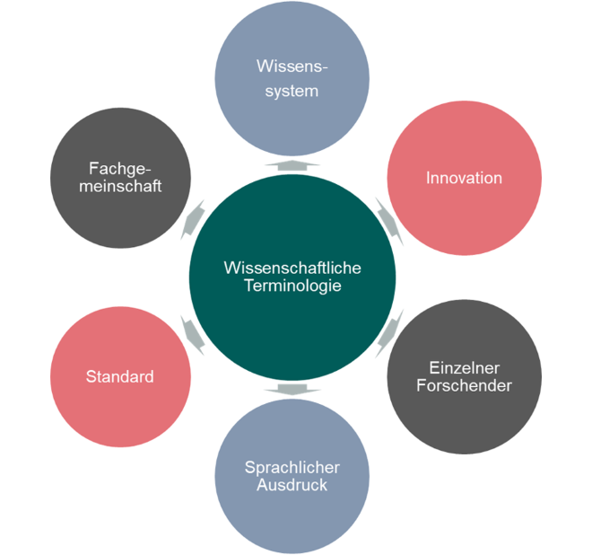

# Herausforderungen für Terminologien

Die Terminologie eines Fachgebiets ist ein wichtiges Werkzeug für die Arbeit im Fach.
Einerseits ist sie ein wichtiges Kommunikatonsmittel der einzelnen ForscherInnen sowie der gesamten Forschungsgemeinschaft des Faches.
Andererseits ist sie ein Artefakt, mit dem das Wissen eines Fachgebiets laufend kodiert wird.
Terminologie steht damit kontinuierlich im Spannungsfeld zwischen

* individuellem und kollektivem Wissensgewinn,
* individueller und kollektiver Kommunikation,
* Wissenskonsolidierung/-standardisierung und Wissensgewinn,
* Wissenssystem und sprachlichem Ausdruck.

<!--  -->

Während der Wissensgewinn eine gewisse Dynamik aufweist, strebt die Wissenskonsolidierung eine Verstetigung an.
Während neues Wissen einen Bedarf nach neuen Benennungen mit sich bringt, erfordert die Kommunikation der Fachgemeinschaft ein gewisses Maß an begrifflicher und ausdrucksseitiger Standardisierung.
Mit diesem Gegensatz müssen sich alle Diszplinen befassen und auseinandersetzen.
Terminologische Klärung, Aktualisierung, Harmonisierung und die weitere terminologische Entwicklung sind eine notwendige, aber selten geschätzte Tätigkeit der fachlichen Arbeit und des wissenschaftlichen Diskurses.
Eine wissenschaftliche Beschäftigung mit der eigenen Terminologie ist jedoch eine wichtige Voraussetzung für die Güte der fachlichen Kommunikation:
Auch durch die Beschaffenheit der Terminologie wird die Präzision, Eindeutigkeit, und Neutralität der Fachkommuniktion bedingt.
<!-- >TODO Weitere optimale Eigenschaften der Fachkommunikation nennen?<-->

Die Arbeit an und mit Terminologie sollte deswegen möglichst systematisch erfolgen und die Ergebnisse sollten nicht nur dokumentiert werden, sondern so dokumentiert werden, dass sie möglichst auch für andere ForscherInnen und AnwenderInnen nachnutzbar sind.

TODO: ergänzen: sprachliche 1:n-Beziehungen

* Ambiguität: Homonymie, Polysemie
* Synonymie

<!-- [13]: ## "tüt" -->