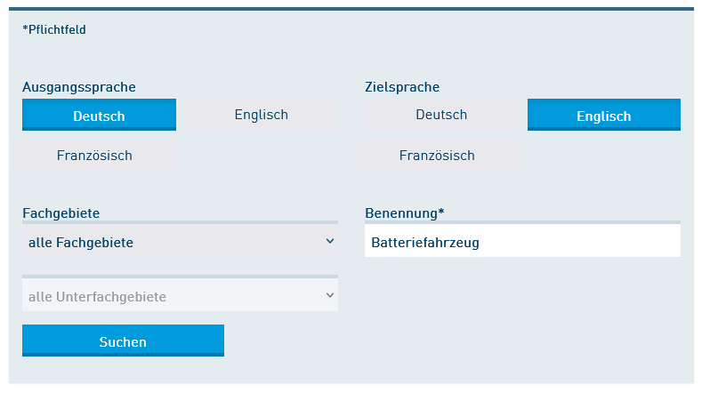
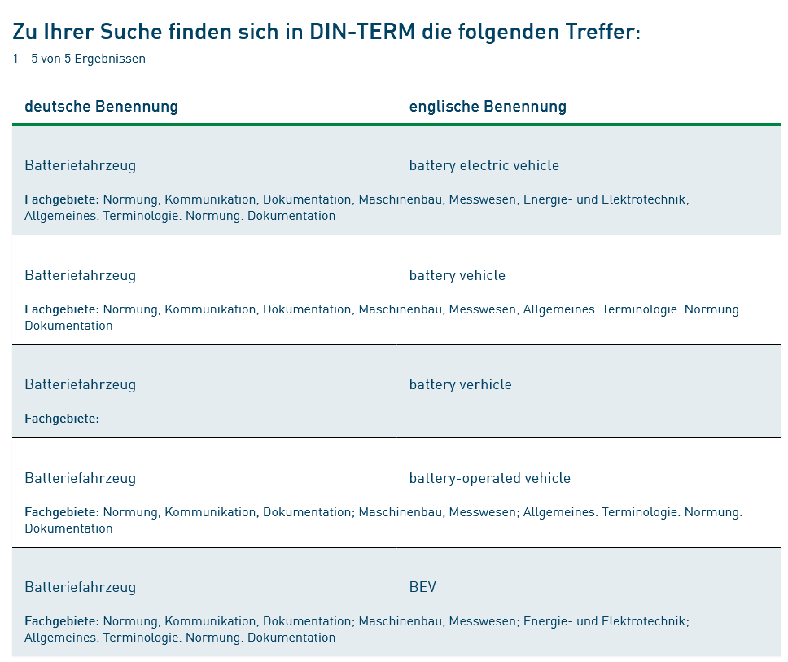

[< Zurück zur Übersicht](tools_Recherche-intro.md)

# DIN-TERM online und DIN-TERMinologieportal

Die nationale Normung hat ein Regelwerk von mittlerweile fast 35.000 Normen erarbeitet, die "spezifische Anforderungen an Produkte, Dienstleistungen oder Verfahren festleg\[en\]" und somit einen wesentlichen Beitrag zur Qualitätsdefinition und -sicherung in diversen Lebensbereichen schaffen [[18]](Literatur.md#source18).

Bei der Normierung von Sachverhalten spielt immer auch eine definierte Terminologie eine wichtige Rolle.
Um eine Norm richtig anzuwenden, sollte die in der Norm verwendete Terminologie den Anwendern bekannt sein.
Um dies sicherzustellen gehört zur Normungsarbeit immer auch die Terminologiearbeit.
Den einzelnen Normen wird obligatorisch immer der Abschnitt _3 Begriffe_ vorangestellt, in dem entweder relevante Begriffe definiert werden oder auf relevante Terminologienormen und Terminologieressourcen der Normung verwiesen wird.

Diese Terminologiefestlegungen der deutschen Normnungslandschaft werden in einer Datenbank erfasst und seit einigen Jahren auch der Öffentlichkeit zur Recherche zugänglich gemacht.
Es gibt hierzu zwei Zugriffsmöglichkeiten, einen frei zugänglichen Dienst und einen registrierungspflichtigen Dienst.

* Mit [DIN-TERM online](https://www.din.de/de/service-fuer-anwender/terminologie/din-termonline) wird ein offener Dienst bereitgestellt, der die Recherche ohne Nutzerauthentifizierung ermöglicht. Zweck des Tools ist die zweisprachige Suche: Gesucht wird hierbei nach in den Normen definierten Benennungen. Bei der Suche müssen Eingangs- und Zielsprache eingestellt werden, sodass zu einer Benennung in der Ausgangssprache ein fachlich anerkanntes Äquivalent in der Zielsprache gefunden wird. Als Sprachen können Deutsch, Englisch und Französisch gewählt werden. Um die Zahl der Suchergebnisse einzuschränken, kann auch noch ein fachlicher Filter gewählt werden.  

  <!--  -->

  Als Suchergebnis werden hierbei dann nur die Benennungen und das Fachgebiet, aus dem die Festlegungen stammen, angezeigt.

  <!--  -->

* Mit dem [DIN-TERMinologieportal](https://www.din.de/de/service-fuer-anwender/terminologie/din-term/suche-nach-benennung) wird dagegen ein registrierungspflichtiger Dienst bereitgestellt, der in den Suchergebnissen die vollständigen Terminologieeinträge darstellen kann - das heißt inklusive Herkunftsgremium, Quelldokument, Definition, in allen verfügbaren Sprachen. Dadurch sind hier dann auch erweiterte Filtermöglichkeiten verfügbar, zum Beispiel kann nicht nur die Terminologie aktueller Normen, sondern auch diejenige zurückgezogener Normen oder von Norm-Entwürfen durchsucht werden. Darüber hinaus kann nach Fachrichtungen differenziert werden oder gezielt nach Normungsorganisationen und einzelnen Ausschüssen unterschieden werden. Auch explorative Zugriffe sind hier möglich, zum Beispiel können alle Begriffsfestlegungen eines Gremiums aufgerufen werden.

[< Zurück zur Übersicht](tools_Recherche-intro.md)