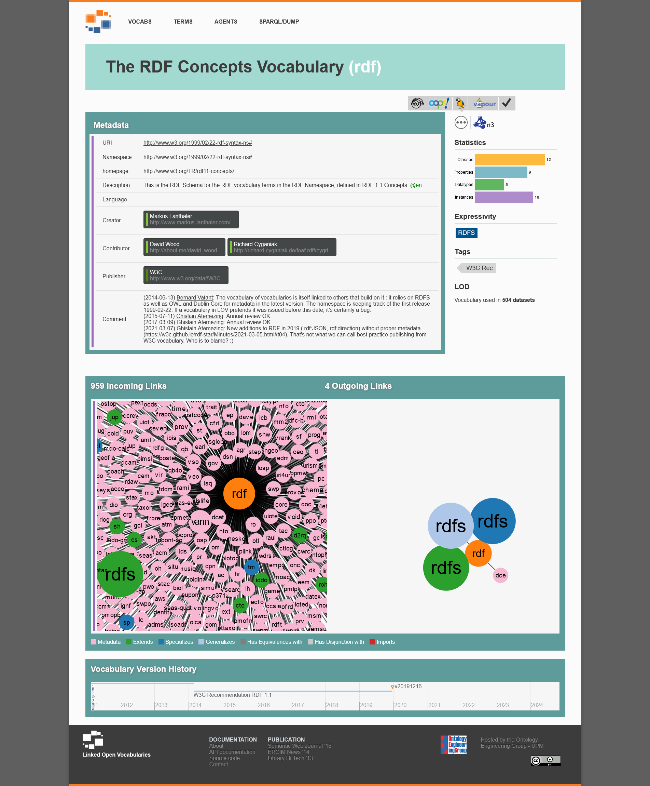

[< Zurück zur Übersicht](tools_Recherche-intro.md)

# Linked Open Vocabularies

[Linked Open Vocabularies (LOV)](https://lov.linkeddata.es/dataset/lov/) ist ein zentrales Verzeichnis für kontrollierte Vokabulare und Ontologien.
Mit seiner Web-Oberfläche kann man einerseits nach bestimmten Vokabularen suchen, sich deren Metadaten anzeigen und ihre Nachnutzung oder Verwendung in anderen Vokabularen visualisieren lassen.
Anderseits kann man die einzelnen Vokabulare auch durchsuchen und so ihre Inhalte erkunden, um geeignete Klassen und Properties zur Nachnutzung zu finden.

Ziel der Plattform ist die Förderung der Wiederverwendung standardisierter Vokabularer im Netz und eine Erhöhung der Interoperabilität von Daten.
Genutzt werden kann es zum Beispiel auch über Maschine-zu-Maschine-Schnittstellen, wie eine eine REST-API, die Daten und Suchergebnisse in JSON bereitstellt, sowie einen SPARQL-Endpunkt, der die Abfrage über SPARQL ermöglicht.
Entwickler können den Dienst so zum Beispiel nutzen, um Vokabulardaten in ihre Anwendungen zu integrieren, zum Beispiel um die Interoperabilität von Daten sicherzustellen: Die Nachnutzung geteilter Vokabulare stellt einen Schritt Richtung Standardisierung dar und erleichtert damit auch die Suche und Erschließung von Daten.

LOV nimmt regelmäßig neue Ressourcen auf und ist auch offen für [Nutzervorschläge](https://lov.linkeddata.es/dataset/lov/suggest).
Bei der Aufnahme neuer Ressourcen wird insbesondere Wert auf die Qualität der Metadaten und die Verfügbarkeit der Ressourcen gelegt.
Eine Empfehlung zur Angabe von Metadaten findet sich als [PDF-Download](https://lov.linkeddata.es/Recommendations_Vocabulary_Design.pdf).
Bei LOV handelt es sich um einen kuratierten Dienst, bei dem Qualitätskontrollen vorgenommen und bestimmte Qualitätskriterien eingehalten werden:

> LOV provides a choice of several hundreds of such [RDF] vocabularies, based on quality requirements including URI stability and availability on the Web, use of standard formats and publication best practices, quality metadata and documentation, identifiable and trustable publication body, proper versioning policy.

Darüber hinaus arcvhiviert LOV Kopien der Vokabulare, sodass zumindest die letzte geprüfte Version eines Vokabulars auch unabhängig vom Anbieter weiter abrufbar ist.

<!-- TODO: automatisierte Verarbeitungsmöglichkeiten und Tests für die integrierten Vokabulare schildern? -->

 
 

<!--  -->

[< Zurück zur Übersicht](tools_Recherche-intro.md)