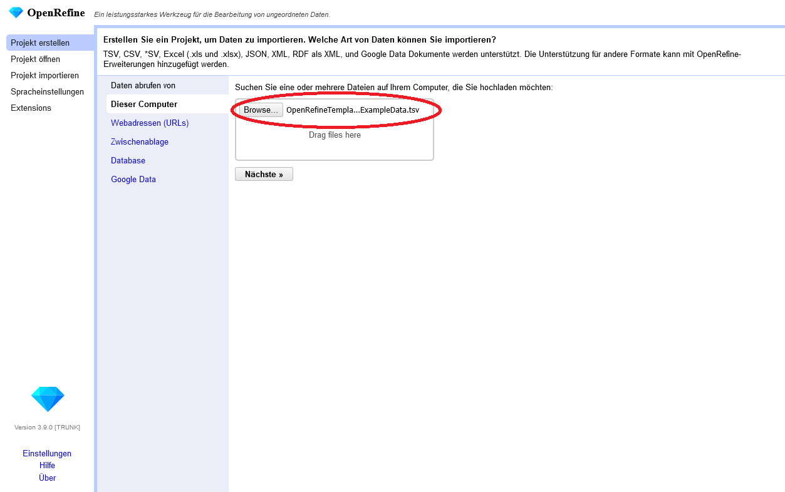
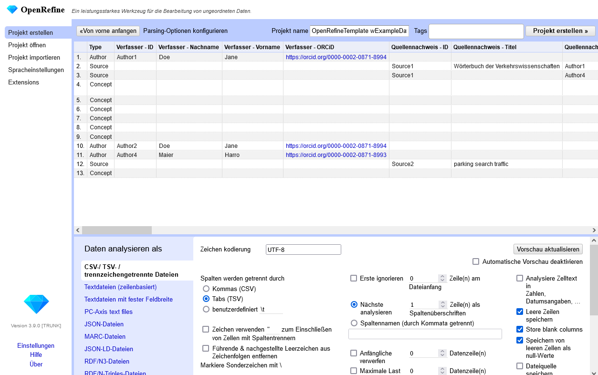
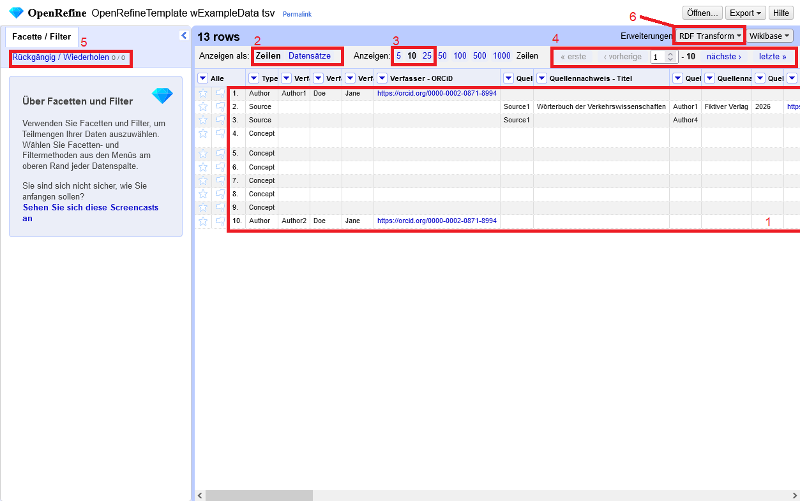
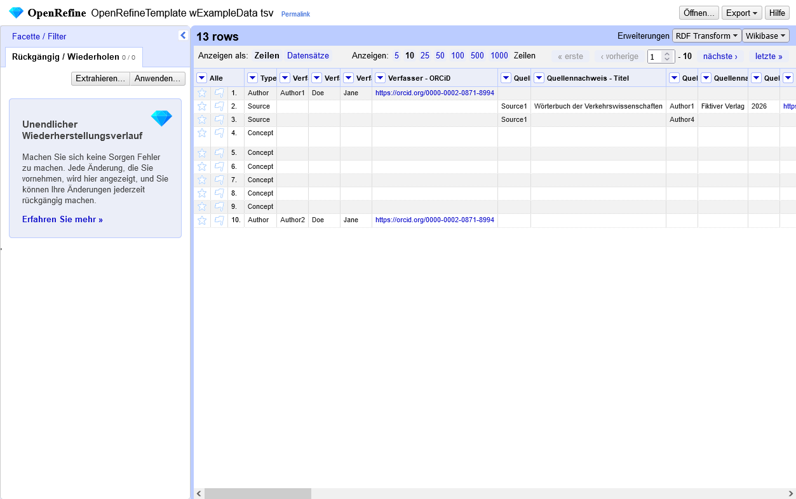
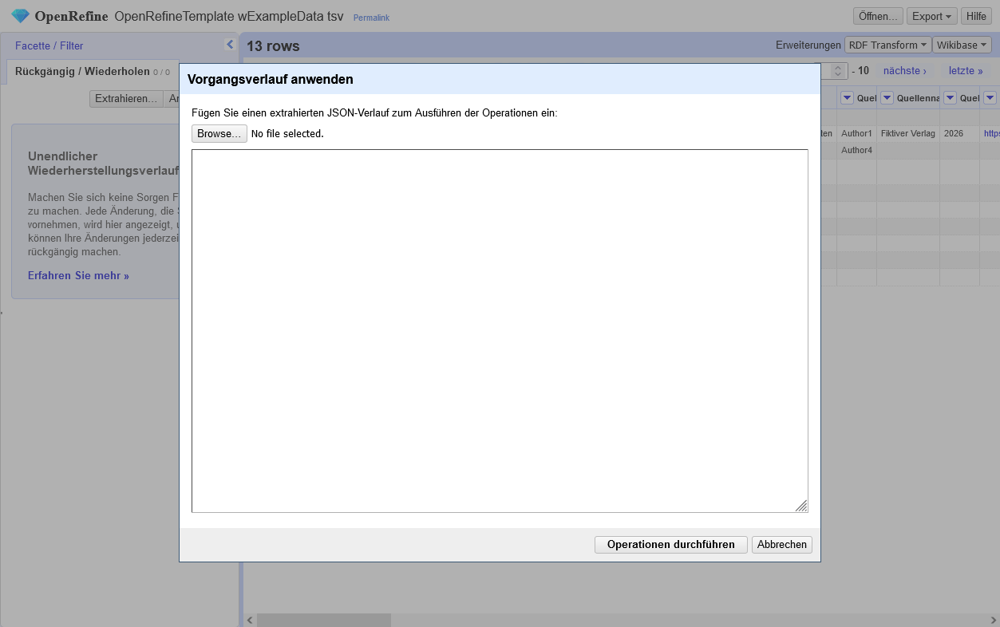
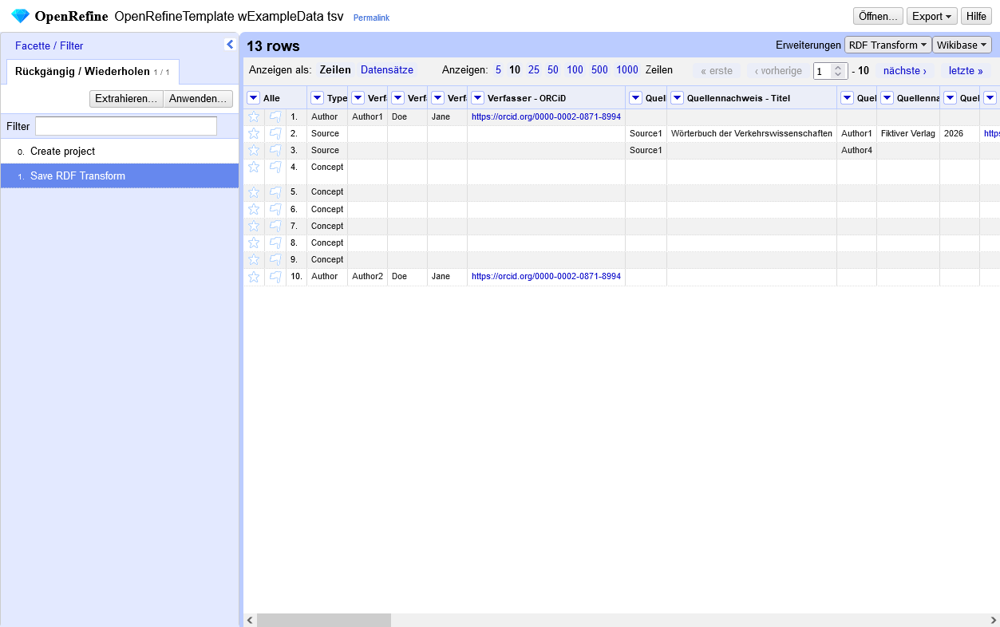
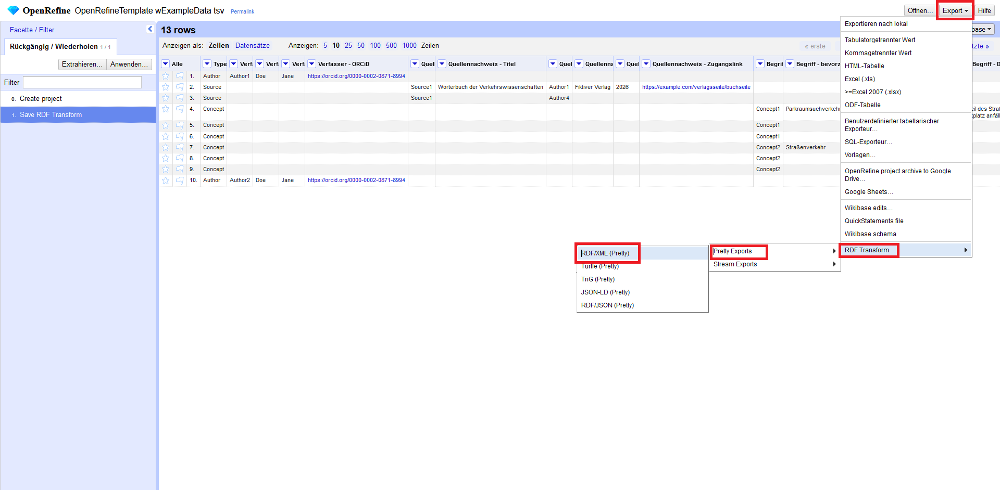

# Konversion nach RDF

An diesem Punkt des Tutorials gehen wir davon aus, dass Sie eine der von uns bereitgestellten [Vorlagen](tutorial-10.md) verwendet haben, um erste Daten zu sammeln sowie das Tool [OpenRefine](tools_OpenRefine.md) installiert haben.
Wenn Sie noch keine Daten gesammelt haben, können Sie den Konvertierungsschritt auch mit unseren Beispieldaten ausprobieren, die sie in einer der folgenden Vorlagen finden:
* [OpenRefineTemplate_wExampleData (Google Sheets)](https://docs.google.com/spreadsheets/d/1EmFfhrcOVAOKf_kfwLzgdKANrdEeT7qKBRdSSPrnlIs/edit?usp=sharing)
* OpenRefineTemplate_wExampleData: [.xslx-Format](https://raw.githubusercontent.com/SArndt-TIB/terminology-guide-for-move/refs/heads/main/OpenRefine_Templates/OpenRefineTemplate_wExampleData.xlsx) | [.csv-Format](https://raw.githubusercontent.com/SArndt-TIB/terminology-guide-for-move/refs/heads/main/OpenRefine_Templates/OpenRefineTemplate_wExampleData.csv) | [.tsv-Format](https://raw.githubusercontent.com/SArndt-TIB/terminology-guide-for-move/refs/heads/main/OpenRefine_Templates/OpenRefineTemplate_wExampleData.tsv)

Im nächsten Schritt nutzen wir OpenRefine, um eine RDF-Version dieser Daten zu erstellen, die dem SKOS-Standard entspricht.

## Schritt 1: Starten Sie OpenRefine

Starten Sie OpenRefine so wie für Ihr Betriebssystem angegeben. Nähere Informationen zum Starten und Beenden der Anwendung finden Sie [hier](https://openrefine.org/docs/manual/running). Beim Start sollte sich bereits ein Webbrowser öffnen oder ein neuer Tab in einem laufenden Webbrowser öffnen, der die Adresse [http://127.0.0.1:3333](http://127.0.0.1:3333) aufruft.
Hier sollte dann der folgende Startbildschirm zu sehen sein:

## Schritt 2: Legen Sie ein neues Projekt an

Gehen Sie zum Menüpunkt `Projekt erstellen`.
Hier können Sie ein Projekt durch Laden einer lokalen Datei starten.
Nach dem Laden der Datei wird zunächst der Dateiname innerhalb der roten Markierung angezeigt.
Um fortzufahren, bestätigen Sie den Vorgang mit dem Button `Nächste`.

Anschließend wird eine Vorschau der Daten angezeigt.
OpenRefine ist in der Lage, das Dateiformat zu erkennen und die Daten entsprechend zu prozessieren.
Dennoch besteht hier noch die Möglichkeit zur Korrektur durch Angabe eines anderen Datenformats.
Darüber hinaus können einige Parameter gesetzt werden, die den Datenimport und letzlich beeinflussen, was in OpenRefine letztelich angezeigt wird.
Insbesondere relevant ist hier natürlich bei trennzeichengetrennten Dateien, die Wahl des korrekten Trennzeichens.
Auch auf die Zeichenkodierung sollte geachtet werden: Für im deutschen Sprachgebrauch verwendete Sonderzeichen sollten die Daten mit Format UTF-8 geladen werden. Auch unsere Vorlagen bedienen diese Kodierung.
Bei kommaseparierten Tabellen kann es vorkommen, dass die Werte selbst Kommas enthalten, sodass hier die Option `Zeichen verwenden zum Einschließen von Zellen mit Spaltentrennern` verwendet werden sollte, damit solche Zellen nicht versehentlich getrennt werden.
Bei der Eingabe in Tabellenkalkulationstools kann es auch ab und an vorkommen, dass ungewollt Leerzeichen vor oder nach dem Wert eingegeben werden. Mit `Führende & nachgestellte Leerzeichen aus Zeichenfolgen entfernen` können diese beim Import gleich entfernt werden.
Mit den Optionen `Erste X Zeilen am Dateianfang`, `Nächste X Zeilen als Spaltenüberschriften analysieren`, `Anfängliche X Datenzeilen verwerfen` und `Lade maximal X Datenzeilen` lässt sich festlegen, ab wo in der Tabelle Daten erfasst werden sollen. Hat eine Tabelle keine Spaltennamen, können diese auch nachträglich im Feld `Spaltennamen (durch Kommata getrennt)` hinzugefügt werden.
Ob leere Zeilen und Spalten gespeichert werden sollen lässt sich ebenso einstellen wie ob eine Dateiquelle oder eine Archivdatei gespeichert werden soll. Wir verwenden hier die voreingestellten Optionen.
Über die Vorschau der Daten lässt sich gut erkennen, ob die Tabelle korrekt ausgelesen wird.
Bevor man das Projekt endgültig anlegt, kann man optional noch den Projektnamen ändern und einige Tags eingeben. 
Dies ist sinnvoll, sobald man mehrere Projekte verwaltet.

Nachdem das Projekt erstellt wurde, wird es geöffnet.
Man sieht dann folgende Stanrtansicht:

1 Die Daten werden auch hier tabellarisch angezeigt. Standardmäßig werden 10 Zeilen angezeigt. 
2 Man hat die Option die Ansicht zwischen Zeilen und Datensätzen umzuschalten. Bei der Form unserer Tabelle ist diese Option nicht bedeutsam. 
3 Man kann einstellen, wieviele Zeilen angezeigt werden sollen und ... 
4 ... einfach in den Daten navigieren. 
5 Die Daten lassen sich darüber hinaus auch mit diversen Facetten und Filtern in beliebige Teilmengen aufteilen. Standardmäßig wird der Reiter `Facette/ Filter` zuerst geöffnet, mit `Rückgängig/ Wiederholen` kann umgeschaltet werden zum Bearbetungsverlauf - alle Zellen lassen sich einzeln oder in Massenbearbeitungen überarbeiten. 
6 Die später benötigte Erweiterung RDF Transform sollte bereits über einen Button aufrufbar sein.

## Schritt 3 - Wechseln Sie zur Bearbeitungshistorie

Wechseln Sie zur Ansicht der Bearbeitungshistorie mit dem Button `Rückgängig / Wiederholen`.
Hier müssen jetzt zwei Buttons - `Extrahieren...` und `Anwenden...` verfügbar sein.

Klicken Sie auf den Button `Anwenden...`.
Es öffnet sich dann ein Eingabefenster, in das Sie einen OpenRefine-Bearbeitungsverlauf einfügen können.
Diesen Bearbeitungsverlauf habe wir bereits auf unserem GitHub-Repositorium in der Datei [rdf-transform-for-move.json](https://raw.githubusercontent.com/SArndt-TIB/terminology-guide-for-move/refs/heads/main/OpenRefine_Templates/rdf-transform-for-move.json) vordefiniert.
Den Inhalt dieser Datei können Sie jetzt einfach in das Fenster hineinkopieren.
Im Anschluss wenden Sie ihn durch Klcik auf den Button `Operationen durchführen`.

Im Anschluss sehen Sie im Verlauf des Projekts dann zwei Bearbeitungsschritte:

0. Create project
1. Save RDF Transform

Der Arbeitsschritt `Save RDF Transform` beinhaltet die Definition eines Mappings der tabellarischen Daten auf ein RDF-basiertes Schema.
Dieses kann nur angewendet werden, wenn die Tabellenvorlagen bei der Bearbeitung nicht in ihrer Struktur geändert wurde.

## Export der RDF-Daten

Um nun einen RDF-Export Ihrer Daten zu erhalten müssen Sie jetzt nicht mehr viel machen.
Lediglich ein Klick auf den Button `Export` und die Auswahl der richtigen Export-Option ist notwendig.
Wir wählen hier unter `RDF Transform` den `Pretty Export` und dort - wegen besserer Lesbarkeit des Codes - `Turtle (Pretty)`.
Die erzeugte Datei wird dabei wie ein Download behandelt.

<!-- HIER WEITER: was kam dabei raus? was hast man da jetzt? -->
