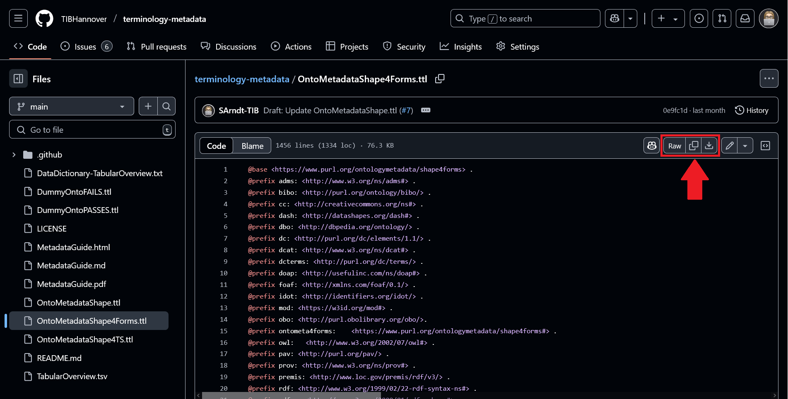
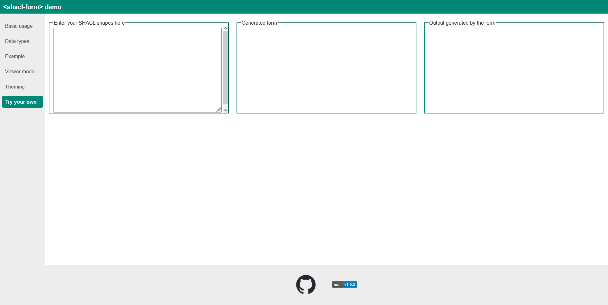
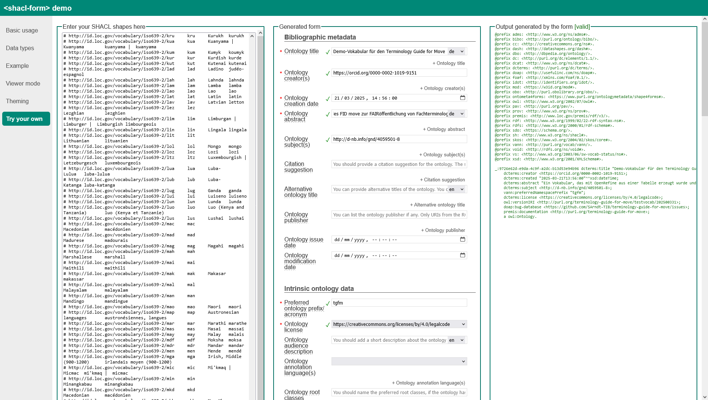
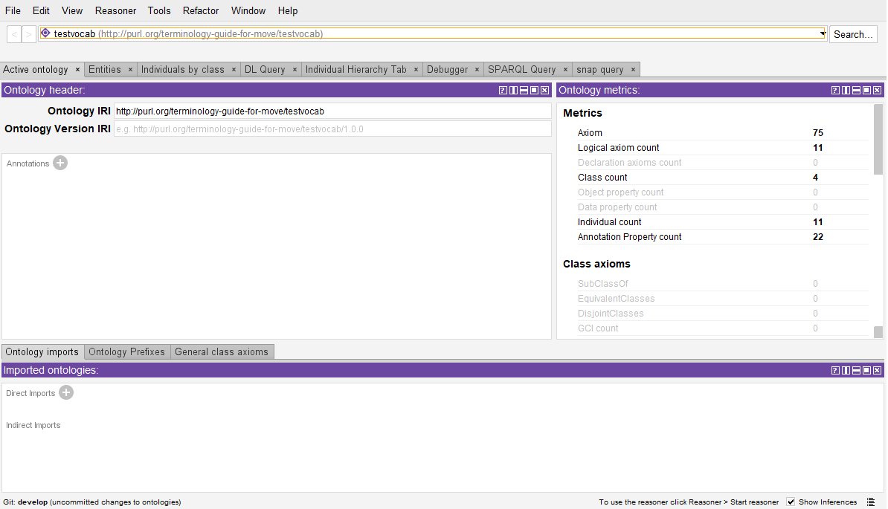

# Metadaten ergänzen

Die im Schritt [Datensammlung, Dokumentation, Konversion](tutorial-12) erzeugten RDF-Dateien sollten jetzt noch um weitere Statements angereichert werden, u.a.mit Metadaten zur gesamten Terminologie und nicht nur zu den einzelnen Einträgen. Warum auch Vokabulare Metadaten haben sollten, erläutern wir [hier](https://github.com/TIBHannover/terminology-metadata/blob/main/MetadataGuide.md#12-why-ontology-metadata).

Hierzu muss das Vokabular als Entität explizit hinzugefügt werden, um darüber Aussagen machen zu können.
Es braucht nun selbst einen Identifier.

In [Schritt 3 des Konversionsprozesses mit OpenRefine](tutorial-11.md#schritt-3---wechseln-sie-zur-bearbeitungshistorie) wurde durch die Datei [https://raw.githubusercontent.com/SArndt-TIB/terminology-guide-for-move/refs/heads/main/OpenRefine_Templates/rdf-transform-for-move.json](https://raw.githubusercontent.com/SArndt-TIB/terminology-guide-for-move/refs/heads/main/OpenRefine_Templates/rdf-transform-for-move.json) bereits eine Festlegung getroffen, wie die Identifier der einzelnen Quellen, Autoren und Begriffe aussehen sollen.

Unsere Vorlage setzt hierfür im Header der JSON-Datei als sogenannte `baseIRI` den Wert `http://purl.org/terminology-guide-for-move/testvocab/`.
Dieser wird verwendet, um für jede der Entitäten einen eindeutigen Identifier zu erstellen, z.B. <http://purl.org/terminology-guide-for-move/testvocab/Concept2>.
Für den Identifier des Vokabulars verwenden wir diesen ohne das abschließende `/`, also `http://purl.org/mydomain/mysubdomain`.

<details>
  <summary>Klicken Sie hier, um den Header der JSON-Datei zu sehen.</summary>

```json
[
  {
    "op": "rdf-transform/save-rdf-transform",
    "rdf-transform": {
      "version": "2.2.4",
      "extension": "RDFTransform",
      "namespaces": {
        "rdf": "http://www.w3.org/1999/02/22-rdf-syntax-ns#",
        "rdfs": "http://www.w3.org/2000/01/rdf-schema#",
        "owl": "http://www.w3.org/2002/07/owl#",
        "xsd": "http://www.w3.org/2001/XMLSchema#",
        "vcard": "http://www.w3.org/2006/vcard/ns#",
        "foaf": "http://xmlns.com/foaf/0.1/",
        "ex": "https://www.example.com/",
        "m4i": "http://w3id.org/nfdi4ing/metadata4ing#",
        "dcterms": "http://purl.org/dc/terms/",
        "dcat": "http://www.w3.org/ns/dcat#",
        "skos": "http://www.w3.org/2004/02/skos/core#",
        "skosxl": "http://www.w3.org/2008/05/skos-xl#"
      },
      "baseIRI": "http://purl.org/terminology-guide-for-move/testvocab/",
      "subjectMappings": [
        // ...
      ]
    }
  }
]
```
</details>

Idealerweise legen Sie die Metadaten in einer eigenen Datei an, z.B. `metadata.ttl` im selben Repositorium, in dem Sie auch die tabellarische Ausgangsdatei sowie den Turtle-Export der RDF-Konversion verwalten.

In dieser Datei ergänzen Sie nun als erstes folgende Statements mit der von Ihnen gewählten `baseIRI`.
Damit Sie diese Datei auch ggf. mit Spezialtools öffnen können, ergänzen wir hier die auch im Turtle-Export festgelegten Präfixe, mit denen in Turtle die URIs der Entitäten abgekürzt werden können.

``` turtle
@prefix :        <http://purl.org/terminology-guide-for-move/testvocab/> . # ggf. ändern, wenn Sie nicht mit den Beispieldaten unseres Tutorials arbeiten
@prefix dcat:    <http://www.w3.org/ns/dcat#> .
@prefix dcterms: <http://purl.org/dc/terms/> .
@prefix ex:      <https://www.example.com/> .
@prefix foaf:    <http://xmlns.com/foaf/0.1/> .
@prefix m4i:     <http://w3id.org/nfdi4ing/metadata4ing#> .
@prefix owl:     <http://www.w3.org/2002/07/owl#> .
@prefix rdf:     <http://www.w3.org/1999/02/22-rdf-syntax-ns#> .
@prefix rdfs:    <http://www.w3.org/2000/01/rdf-schema#> .
@prefix skos:    <http://www.w3.org/2004/02/skos/core#> .
@prefix skosxl:  <http://www.w3.org/2008/05/skos-xl#> .
@prefix vcard:   <http://www.w3.org/2006/vcard/ns#> .
@prefix xsd:     <http://www.w3.org/2001/XMLSchema#> .

<http://purl.org/mydomain/mysubdomain> rdf:type owl:Ontology ;
  rdf:type skos:ConceptScheme.

```

Die TIB – Leibniz-Informationszentrum Technik und Naturwissenschaften und Universitätsbibliothek hat eine Empfehlung für Metadaten für RDF-basierte Terminologien herausgegeben, die Sie bei der Angabe von minimalen bis sehr umfassenden Metadaten unterstützt.

Sie finden diese Empfehlung ebenfalls auf [GitHub](https://github.com/TIBHannover/terminology-metadata).
Insbesondere der dort beschriebene Use Case [Metadata recommendations in SHACL - For metadata form generators](https://github.com/TIBHannover/terminology-metadata?tab=readme-ov-file#for-metadata-form-generators) erlaubt Ihnen die schnellste Erfassung von empfohlenen Metadaten für Ihre Terminologie.
Sie finden dort auch ein kurzes Einführungsvideo zur Nutzung.

<details>
<!-- <video  width="320" height="240" controls>
    <source src="images/form_generator-low-qual.mp4" type="video/mp4">
</video> -->

<summary>
Zeig mir das Video
</summary>

[form_generator-low-qual.mp4](images/form_generator-low-qual.mp4 ':include :type=video controls width=100%')
</details>

Im Wesentlichen müssen Sie folgende Schritte durchführen:

1. Gehen Sie zur Datei <https://github.com/TIBHannover/terminology-metadata/blob/main/OntoMetadataShape4Forms.ttl> und kopieren Sie den Quellcode dieser Datei:
  <details>
  <summary>
  Zeig mir wie es geht
  </summary>

  
  </details>
2. Gehen Sie zur Live-Demo des Dienstes [SHACL Form Generator](https://ulb-darmstadt.github.io/shacl-form/) der ULB Darmstadt, in den Menü-Punkt [Try your own](https://ulb-darmstadt.github.io/shacl-form/#try-your-own).
  
  <details>
  <summary>
  Zeige den Screenshot des Tools
  </summary>

  
  </details>
3. Fügen Sie den kopierten Quellcode in die Box mit der Überschrift `Enter your SHACL shapes here` ein und verlassen Sie dann das Feld (zum Beispiel mit der Tabulator-Taste oder durch Klicken auf einen anderen Teil des Tools). Dabei wird ein Formular generiert, in das Sie Ihre Metadaten eingeben können und das zugleich aus den eingegebenen Werten Code generiert und validiert. Die Beispieldaten zeigen Metadaten für das Testvokabular dieses Tutorials:
  
  <details>
  <summary>
  Zeige den Screenshot des Tools
  </summary>

  
  </details>

  Sollten Sie Schwierigkeiten mit den angefragten Daten haben, können Sie weitere Hilfestellungen in unserem [Metadaten-Guide](https://github.com/TIBHannover/terminology-metadata/blob/main/MetadataGuide.md) bekommen. Bei Fragen zur Metadaten-Empfehlung können Sie diese in unserem zugehörigen [GitHub-Diskussionforum (Abschnitt Q&A)](https://github.com/TIBHannover/terminology-metadata/discussions/categories/q-a) stellen. Vorschläge und Bugs können Sie uns direkt im [Issue-Tracker](https://github.com/TIBHannover/terminology-metadata/issues) mitteilen.
4. Nachdem Sie mindestens die Pflichteingaben in der erwarteten Form gemacht haben, werden die Daten als valide angesehen und Sie können den generierten Code kopieren, um ihn für Ihre eigenen Daten zu nutzen. Sie können dazu die Daten exportieren oder einfach kopieren und in einen Text-Editor speichern. Ein beispielhafter Output wäre:

  <details>
  <summary>Zeige den Code </summary>  

  ``` turtle
  @prefix adms: <http://www.w3.org/ns/adms#>.
  @prefix bibo: <http://purl.org/ontology/bibo/>.
  @prefix cc: <http://creativecommons.org/ns#>.
  @prefix dash: <http://datashapes.org/dash#>.
  @prefix dbo: <http://dbpedia.org/ontology/>.
  @prefix dc: <http://purl.org/dc/elements/1.1/>.
  @prefix dcat: <http://www.w3.org/ns/dcat#>.
  @prefix dcterms: <http://purl.org/dc/terms/>.
  @prefix doap: <http://usefulinc.com/ns/doap#>.
  @prefix foaf: <http://xmlns.com/foaf/0.1/>.
  @prefix idot: <http://identifiers.org/idot/>.
  @prefix mod: <https://w3id.org/mod#>.
  @prefix obo: <http://purl.obolibrary.org/obo/>.
  @prefix ontometa4forms: <https://www.purl.org/ontologymetadata/shape4forms#>.
  @prefix owl: <http://www.w3.org/2002/07/owl#>.
  @prefix pav: <http://purl.org/pav/>.
  @prefix prov: <http://www.w3.org/ns/prov#>.
  @prefix premis: <http://www.loc.gov/premis/rdf/v3/>.
  @prefix rdf: <http://www.w3.org/1999/02/22-rdf-syntax-ns#>.
  @prefix rdfs: <http://www.w3.org/2000/01/rdf-schema#>.
  @prefix sdo: <https://schema.org/>.
  @prefix sh: <http://www.w3.org/ns/shacl#>.
  @prefix skos: <http://www.w3.org/2004/02/skos/core#>.
  @prefix vann: <http://purl.org/vocab/vann/>.
  @prefix void: <http://rdfs.org/ns/void#>.
  @prefix vs: <http://www.w3.org/2003/06/sw-vocab-status/ns#>.
  @prefix xsd: <http://www.w3.org/2001/XMLSchema#>.

  _:9726e62d-e9da-4c9f-a2dc-b13d53e94b96 dcterms:title "Demo-Vokabular für den Terminology Guide for Move"@de;
      dcterms:creator <https://orcid.org/0000-0002-1019-9151>;
      dcterms:created "2025-03-21T13:56:00"^^xsd:dateTime;
      dcterms:abstract "Ein Vokabular, das mit OpenRefine aus einer Tabelle erzeugt wurde und das als Demonstrationsmaterial in einem Tutorial des FID move zur FAIRöffentlichung von Fachterminologie dient."@de;
      dcterms:subject <http://d-nb.info/gnd/4059501-8>;
      vann:preferredNamespacePrefix "tgfm";
      dcterms:license <https://creativecommons.org/licenses/by/4.0/legalcode>;
      owl:versionIRI <http://purl.org/terminology-guide-for-move/testvocab/202500331>;
      doap:bug-database <https://github.com/SArndt-TIB/terminology-guide-for-move/issues>;
      premis:documentation <http://purl.org/terminology-guide-for-move>;
      a owl:Ontology.
  ```
  </details>
  
5. Die Präfix-Definitionen dieses Codes können in die Metadaten-Datei `metadata.ttl` für Ihr Vokabular übernommen werden. So wird sichergestellt, dass alle übernommenen Statements weiterhin korrekt interpretiert werden können. Die einzelnen Statements, die vom Tool der ULB erzeigt wurden, beziehen sich nun auf ein anonymes, nicht-benanntes Element, einen sogenannten _blank node_, der über den Wert `_:9726e62d-e9da-4c9f-a2dc-b13d53e94b96` repräsentiert wird. Diesen Wert können Sie als einen Platzhalter auffassen, der durch die baseIRI Ihres eigenen Vokabulars ersetzt werden muss. Das Statement `_:9726e62d-e9da-4c9f-a2dc-b13d53e94b96 a owl:Ontology` können Sie weglassen, da wir bereits ein vergleichbares Statement in metadata.ttl ergänzt hatten - allerdings mit einer von uns gewählten URL für die Datei und der vollausgeschriebenen Form `rdf:type` von `a`.
Die restlichen Statements können Sie in die Datei `metadata.ttl` übernehmen.
Am Ende könnte `metadata.ttl` also folgenden Inhalt haben:

  <details>
  <summary>Zeige den Code</summary>

    ``` turtle
    @prefix :        <http://purl.org/terminology-guide-for-move/testvocab/> . # ggf. ändern, wenn Sie nicht mit den Beispieldaten unseres Tutorials arbeiten
    @prefix dcat:    <http://www.w3.org/ns/dcat#> .
    @prefix dcterms: <http://purl.org/dc/terms/> .
    @prefix ex:      <https://www.example.com/> .
    @prefix foaf:    <http://xmlns.com/foaf/0.1/> .
    @prefix m4i:     <http://w3id.org/nfdi4ing/metadata4ing#> .
    @prefix owl:     <http://www.w3.org/2002/07/owl#> .
    @prefix skos:    <http://www.w3.org/2004/02/skos/core#> .
    @prefix skosxl:  <http://www.w3.org/2008/05/skos-xl#> .
    @prefix vcard:   <http://www.w3.org/2006/vcard/ns#> .
    @prefix xsd:     <http://www.w3.org/2001/XMLSchema#> .
    @prefix adms: <http://www.w3.org/ns/adms#>.
    @prefix bibo: <http://purl.org/ontology/bibo/>.
    @prefix cc: <http://creativecommons.org/ns#>.
    @prefix dash: <http://datashapes.org/dash#>.
    @prefix dbo: <http://dbpedia.org/ontology/>.
    @prefix dc: <http://purl.org/dc/elements/1.1/>.
    @prefix doap: <http://usefulinc.com/ns/doap#>.
    @prefix idot: <http://identifiers.org/idot/>.
    @prefix mod: <https://w3id.org/mod#>.
    @prefix obo: <http://purl.obolibrary.org/obo/>.
    @prefix ontometa4forms: <https://www.purl.org/ontologymetadata/shape4forms#>.
    @prefix pav: <http://purl.org/pav/>.
    @prefix prov: <http://www.w3.org/ns/prov#>.
    @prefix premis: <http://www.loc.gov/premis/rdf/v3/>.
    @prefix rdf: <http://www.w3.org/1999/02/22-rdf-syntax-ns#>.
    @prefix rdfs: <http://www.w3.org/2000/01/rdf-schema#>.
    @prefix sdo: <https://schema.org/>.
    @prefix sh: <http://www.w3.org/ns/shacl#>.
    @prefix vann: <http://purl.org/vocab/vann/>.
    @prefix void: <http://rdfs.org/ns/void#>.
    @prefix vs: <http://www.w3.org/2003/06/sw-vocab-status/ns#>.

    <http://purl.org/terminology-guide-for-move/testvocab/>  rdf:type owl:Ontology ;
      rdf:type skos:ConceptScheme;
      <!-- ab hier finden Sie die mit dem Tool der ULB-Darmstadt erzeugten Statments -->
      dcterms:title "Demo-Vokabular für den Terminology Guide for Move"@de;
      dcterms:creator <https://orcid.org/0000-0002-1019-9151>;
      dcterms:created "2025-03-21T13:56:00"^^xsd:dateTime;
      dcterms:abstract "Ein Vokabular, das mit OpenRefine aus einer Tabelle erzeugt wurde und das als Demonstrationsmaterial in einem Tutorial des FID move zur FAIRöffentlichung von Fachterminologie dient."@de;
      dcterms:subject <http://d-nb.info/gnd/4059501-8>;
      vann:preferredNamespacePrefix "tgfm";
      dcterms:license <https://creativecommons.org/licenses/by/4.0/legalcode>;
      owl:versionIRI <http://purl.org/terminology-guide-for-move/testvocab/202500331>;
      doap:bug-database <https://github.com/SArndt-TIB/terminology-guide-for-move/issues>;
      premis:documentation <http://purl.org/terminology-guide-for-move>;
      .
  ```
  </details>

* [ ] jetzt noch erklären, wie man den OpenRefine-Output und die metadata.ttl zusammenbringt
<!-- testen, ob die Verwendung derselben IRI im metadata.ttl nicht vielleicht doch als Fehler erkannt wird -->
* [ ] PURL für metadata.ttl anlegen
* [ ] metadata.ttl ins Repo pushen
* [ ] 
Die Datei `metadata.ttl` kann separat auf dem GitHub-Repositorium verwaltet werden und vom Vokabular importiert werden.
Hierfür muss dem Vokabular nach dem Erzeugen ein Statement hinzugefügt werden, in dem der Ort der Datei `metadata.ttl` angegeben wird.
Dies kann entweder ein raw-Link von GitHub sein, was in unserem Fall <https://raw.githubusercontent.com/SArndt-TIB/terminology-guide-for-move/refs/heads/develop/OpenRefine_Templates/OpenRefineTemplate_wExampleData_tsv.ttl> wäre.
Wir können aber auch für diese Datei eine PURL einrichten, z.B. <http://purl.org/terminology-guide-for-move/testvocab/metadata>.

``` turtle
<http://purl.org/terminology-guide-for-move/testvocab/> owl:imports <http://purl.org/terminology-guide-for-move/testvocab/metadata>.
```

Durch den Import werden in Anwendungen, die den Turtle-Code laden können, dann auch die Metadaten geladen. Wir zeigen den Unterschied im Screenshot im Editor Protégé

<details>
<summary>
Zeige den Vergleich
</summary>

|Ohne Metadaten|Mit Metadaten|
|-|-|
|||

</details>

Bei diesem Verfahren sollte man jedoch sehr genau darauf achten, dass die Metadaten bei einer neuen Erzeugung des Vokabulars aktualisiert werden und dass auch das IMport-Statement in einer neuen Version des Vokabulars nicht vergessen wird.