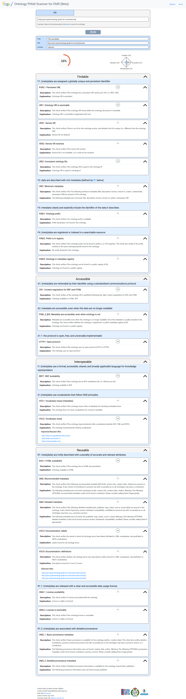
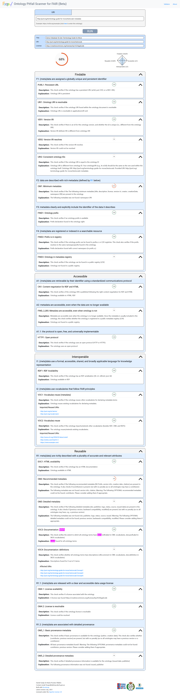

# Validierung, Qualitätsprüfung, FAIRness

## FAIRness eines Vokabulars

Auch Terminologien, die für das Semantic Web aufbereitet werden, sollen am Ende den [FAIR-Prinzipien](https://www.go-fair.org/fair-principles/) genügen.
Das bedeutet, sie müssen **F**indable (auffindbar), **A**ccessible (zugänglich), **I**nteroperable (interoperabel) und **R**e-Usable (nachnutbar) sein.
Die FAIR-Prinzipien legen eine Reihe von Kriterien fest, die erfüllt sein müssen, damit eine Ressource FAIR ist.
Inzwischen wurden diese Kriterien auch schon im Sinne "semantischer Artefakte" (z.B. SKOS-Vokabulare, wie wir es hier erstellt haben) interpretiert und in entsprechenden Prüftools implementiert.
Ein solches Tool ist der [FOOPS Validator](https://foops.linkeddata.es/FAIR_validator.html), in den man einfach nur den Link einer Ressource eingeben muss, um eine Einschätzung ihrer FAIRness gegeliedert nach den einzelnen FAIR-Prinzipien zu bekommen.

Versuchen wir dies einmal mit dem im GitHub-Repositorium abgelegten Test-Vokabular, das wir im Schritt [Tabellarische Datenverwaltung für OpenRefine](tutorial-13.md) erstellt haben und für das wir in [Identifier erstellen](tutorial-7.md#purlorg) die PURL <http://purl.org/terminology-guide-for-move/testvocab> eingerichtet hatten.

Zeige Ergebnis des FOOPS-Validators für &#60;http://purl.org/terminology-guide-for-move/testvocab&#62;

Das Ergebnis ist noch relativ ernüchternd - das Vokabular erreicht gerade einmal 38&nbsp;% der maximal erreichbaren Punktzahl.
Dies liegt vor allem daran, dass hier noch keine Metadaten zum Vokabular enthalten sind.
Führen wir denselben Test für <http://purl.org/terminology-guide-for-move/testvocab+metadata> aus, so verdoppelt sich die erreichte Punktzahl ungefähr.

Zeige Ergebnis des FOOPS-Validators für &#60;http://purl.org/terminology-guide-for-move/testvocab+metadata&#62;

<!--  -->

Es gibt jedoch noch immer einige Punkte, die angemerkt werden:

* Der Test _URI2: Consistent ontology IDs_ tritt hier nur auf, weil wir zwei verschiedene Dateien angelegt haben, die innerhalb der Datei, denselben Identifiert verwenden, aber tatsächlich durch verschiedene Identifier aufgerufen werden müssen.
  Wenn man - anders als in diesem Tutorial zu Demonstrationszwecken geschehen - nur eine Datei für das Vokabular anlegt (inkl. Metadaten) und die dafür registrierte PURL verwendet, schlägt dieser Test nicht aus.
* Die Tests _OM1: Minimum metadata_, _OM2: Recommended metadata_, _OM3: Detailed metadata_ und _OM5&#95;2: Detailed provenance metadata_ suchen nach Metadaten, die wir auch empfehlen, jedoch nicht vorschreiben und im Rahmen der Metadatengenerierung im Rahmen dieses Tutorials nicht angegeben haben.
* Der Test _FIND3: Ontology in metadata registry_ prüft, ob das Vokabular oder zumindest seine Metadaten in einem Terminology Service registriert sind. Der Test prüft dabei ausschließlich die Registrierung bei [Linked Open Vocabularies](https://lov.linkeddata.es/dataset/lov) ab und hat deswegen nur begrenzte Aussagekraft.
  Dasselbe prüft auch der Test _FIND&#95;3&#95;BIS: Metadata are accessible, even when ontology is not_ allerdings mit einer anderen Fragestellung. Auch hier wird die Prüfung nur auf [Linked Open Vocabularies](https://lov.linkeddata.es/dataset/lov) durchgeführt.
* Der Test _VER2: Version IRI resolves_ schlägt heute (24.03.2025) noch aus, weil ein Versions-Identifier in der Ontologie zwar schon verwendet wurde, aber noch keine Weiterleitung eingerichtet werden konnte, da wir noch kein entsprechendes Release herausgeben konnten. Dieser Test kann erst positiv sein, wenn das Release erschienen ist.
* _VOC4: Documentation: definitions_ sucht nach beschreibenden Texten für die einzelnen Begriffe. Unser Vokabular entspricht hierbei nicht ganz dem wonach dieses Tool sucht. Wir haben das Vokabular sowohl als OWL Ontologie als auch als SKOS Vokabular deklariert. Das Tool scheint es nur einer dieser beiden Kategorien zuzuordnen und sucht deswegen nach rdfs:comments. Diese Properties verwendet das Vokabular nicht, da sie viel zu allgemein ist. Stattdessen verwenden wir eine Property namens `skos:definition`.

* jskos
* SKOS Play
* Metadata validation
