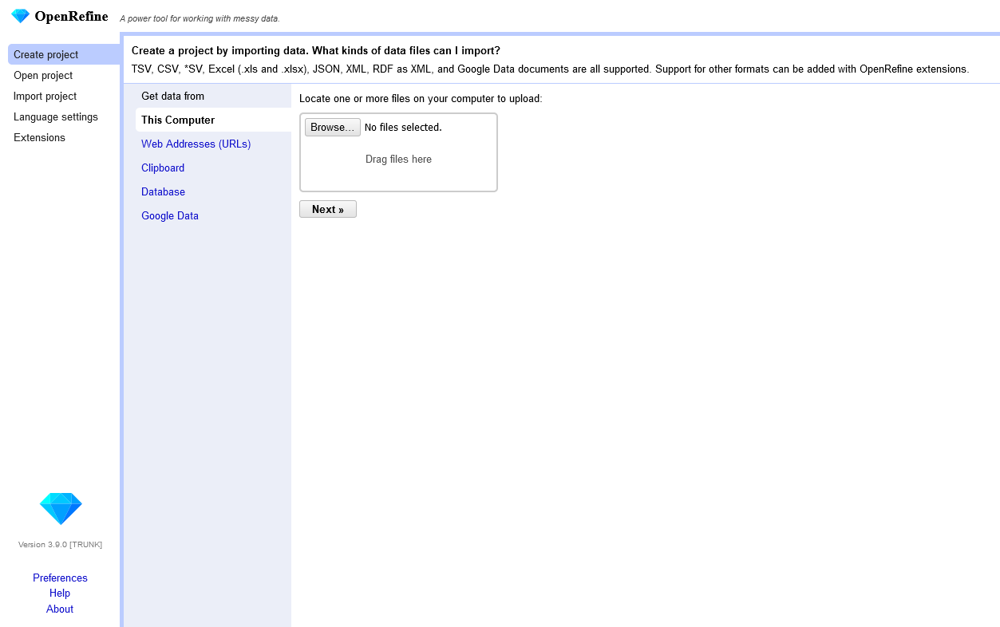
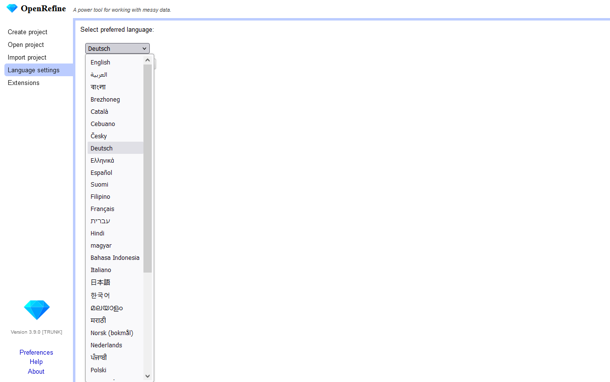
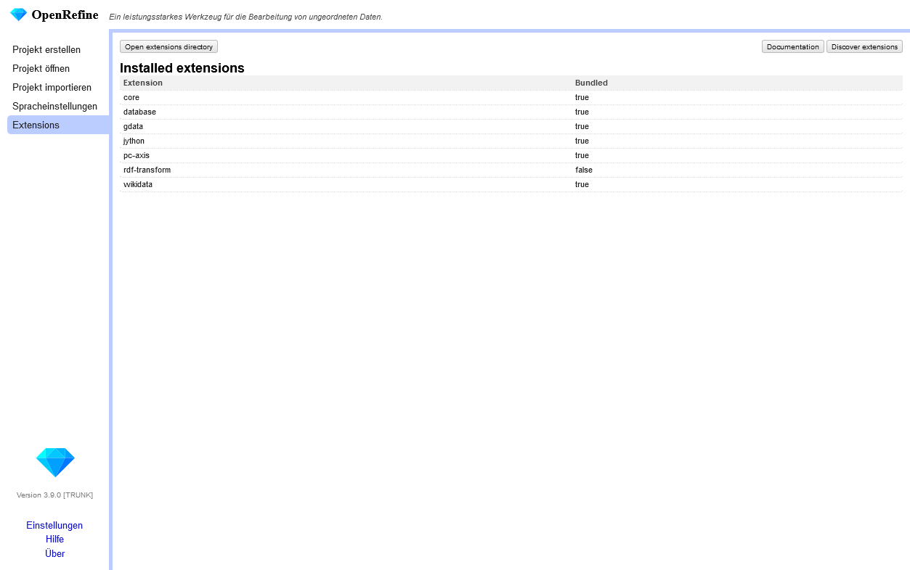

# Einführung: OpenRefine

## Was ist OpenRefine?

OpenRefine ist ein sehr mächtiges aber gut zu erlernendes Open-Source-Tool, mit dem man Daten

* in unterschiedlichsten Formaten laden,
* explorieren,
* verstehen,
* bei Bedarf bereinigen,
* transformieren,
* anreichern und
* in anderen Formaten wieder exportieren kann.

Das explizite Ziel dieses Tools ist es, die Arbeit mit Daten für diverse Zielgruppen zu ermöglichen oder zu erleichtern. Zur Vision gibt es [hier ↗](https://openrefine.org/mission_vision) mehr Informationen.

OpenRefine kann lokal, auf dem eigenen Rechner, installiert werden. Die grafische Oberfläche des Tools wird dann über einen Webbrowser geladen, der unter der Adresse [http://127.0.0.1:3333 ↗](http://127.0.0.1:3333) lokal zu erreichen ist.

## OpenRefine zur Erstellung kontrollierter Vokabulare nach SKOS

OpenRefine eignet sich auch sehr gut dazu eine tabellarische Ausgangsdatei für ein Vokabular in eine Semantic-Ressource zu verwandeln. Wir stellen Ihnen in unserem Tutorial entsprechende Templates sowie Anpassungsmöglichkeiten vor, mit denen Sie fast sofort loslegen können.

## Installation und Einrichtung

OpenRefine wird für verschiedene Plattformen angeboten, zum Beispiel für Windows, Linus oder McOS.
Entsprechende Downloads des aktuellsten Releases finden sich unter [https://openrefine.org/download ↗](https://openrefine.org/download).
Ältere Versionen können auch von GitHub bezogen werden, siehe [https://github.com/OpenRefine/OpenRefine/releases ↗](https://github.com/OpenRefine/OpenRefine/releases).
Unser Tutorial basiert auf der Verwendung von OpenRefine für Windows, Version 3.9.0 mit OpenJDK Runtime Environment 11.0.26+4.
Zur Installation oder zum Upgrade einer vorhandenen Installation auf eine neuere Version verweisen wir auf die [OpenRefine Installationsnanleitung ↗](https://openrefine.org/docs/manual/installing).
Damit OpenRefine auch größere Datensätze verarbeiten kann, ist es empfehlenswert, [mehr Memory zuzuordnen ↗](https://openrefine.org/docs/manual/installing#increasing-memory-allocation).

Neben OpenRefine benötigen wir zudem die OpenRefine-Erweiterung [RDF Transform ↗](https://github.com/AtesComp/rdf-transform). Zur Installation dieser Erweiterung verweisen wir auf die [Anleitung zur Installation von Erweiterungen ↗](https://openrefine.org/docs/manual/installing#installing-extensions) auf der [OpenRefine-Homepage ↗](https://openrefine.org/) sowie auf die [Installationshinweise ↗](https://github.com/AtesComp/rdf-transform/wiki/Install) des Anbieters der Erweiterung. Sollten bei der Installation Probleme auftreten, empfehlen wir, zum Triubleshooting Plattformen wie das [OpenRefine-Community-Forum ↗](https://forum.openrefine.org/), das [Troubleshooting ↗](https://openrefine.org/docs/manual/troubleshooting) oder die [FAQ ↗](https://github.com/OpenRefine/OpenRefine/wiki/FAQ) zu verwenden.

Nach der Installation sollten Sie OpenRefine so wie für Ihr Betriebssystem angegeben starten können. Nähere Informationen zum Starten und Beenden der Anwendung finden Sie [hier ↗](https://openrefine.org/docs/manual/running). Beim Start sollte sich bereits ein Webbrowser öffnen oder ein neuer Tab in einem laufenden Webbrowser öffnen, der die Adresse [http://127.0.0.1:3333 ↗](http://127.0.0.1:3333) aufruft.
Hier sollte dann der folgende Startbildschirm zu sehen sein:

Standardmäßig ist die Sprache der Benutzeroberfläche auf Englisch eingestellt. Unter `Language Settings` kann die Sprache auch geändert werden:

Ob die Erweiterung installiert wurde, lässt sich in der Liste der Erweiterungen sehen:

Im Abschnitt [Nützliche Links](#nützliche-links) finden Sie zudem weitere Links und nützliche Ressourcen zur Einführung in OpenRefine.

## Nützliche Links

* [OpenRefine Homepage ↗](https://openrefine.org/)
* [Download OpenRefine ↗](https://openrefine.org/download)
* [Documentation ↗](https://openrefine.org/docs)
  * [Installation instructions ↗](https://openrefine.org/docs/manual/installing)
* [Community-Forum ↗](https://forum.openrefine.org/)
* [FAQ ↗](https://github.com/OpenRefine/OpenRefine/wiki/FAQ)
* [OpenRefine-Wiki auf GitHub ↗](https://github.com/OpenRefine/OpenRefine/wiki) > Unterseiten dieses Wikis sind teilweise schon umgezogen in die Nutzerkodumentation auf der [OpenRefine-Homepage ↗](https://openrefine.org/)
* [Ressourcen-Liste auf der OpenRefine-Homepage ↗](https://openrefine.org/external_resources)
* [Ressourcen-Liste im OpenRefine GitHub-Wiki ↗](https://github.com/OpenRefine/OpenRefine/wiki/External-Resources)
* [OpenRefine Extensions ↗](https://openrefine.org/extensions)
  * [OpenRefine-Extensions installieren ↗](https://openrefine.org/docs/manual/installing#installing-extensions)
  * [RDF Transform ↗](https://github.com/AtesComp/rdf-transform)
    * [Hinweise zur Installation ↗](https://github.com/AtesComp/rdf-transform/wiki/Install)
    * [Features ↗](https://github.com/AtesComp/rdf-transform/wiki/Features)
  * [OpenRefine extension for Google Sheets and Google Drive ↗](https://github.com/OpenRefine/refine-gdata-extension)
* [Cleaning Data with OpenRefine ↗](https://programminghistorian.org/en/lessons/cleaning-data-with-openrefine) by Seth van Hooland, Ruben Verborgh, and Max De Wilde at Porgramming Historian
* [Fetching and Parsing Data from the Web with OpenRefine ↗](https://programminghistorian.org/en/lessons/fetch-and-parse-data-with-openrefine) from Evan Peter Williamson at Programming Historian
* [Library Carpentry: OpenRefine ↗](https://librarycarpentry.github.io/lc-open-refine/)
<!-- *  -->
<!-- *  -->
<!-- *  -->
<!-- *  -->