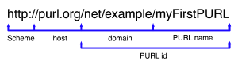
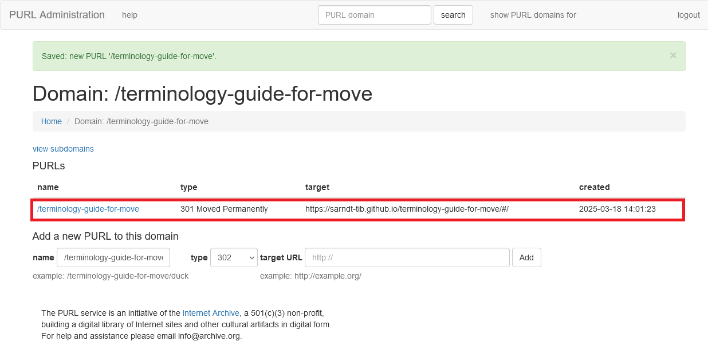
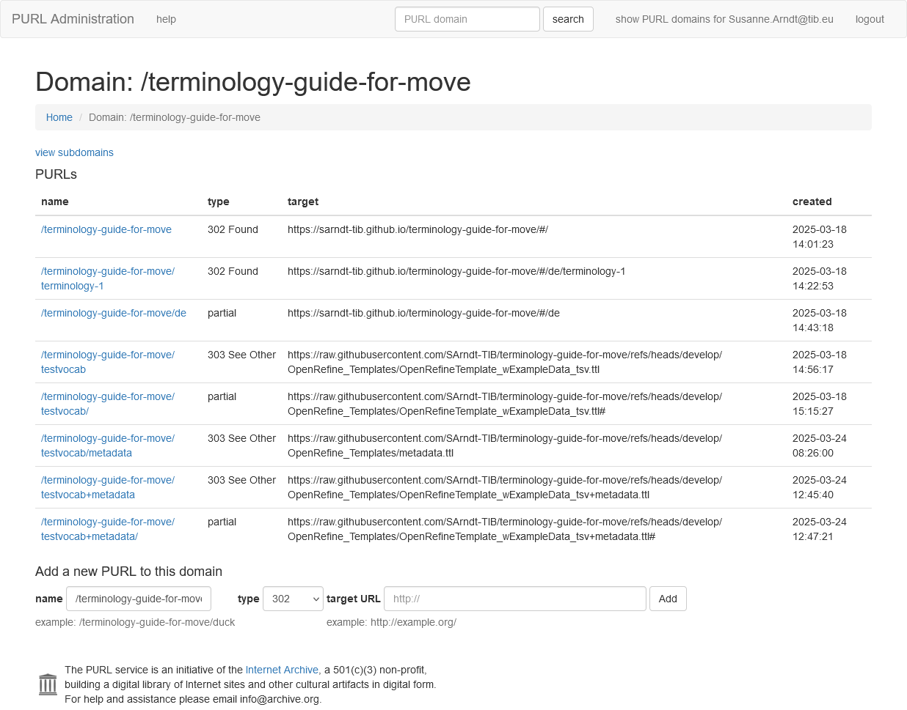

# Identifier erstellen

## Was ist ein Identifier?

Ein Identifier im Kontext der Terminologiearbeit für das Semantic Web ist eine eindeutige Web-Adresse, also ein ([Uniform Resource Identifier (URI) ↗](https://de.wikipedia.org/wiki/Uniform_Resource_Identifier) oder ein [Internationalized Resource Identifier (IRI) ↗](https://de.wikipedia.org/wiki/Internationalized_Resource_Identifier)), mit der eine terminologische Ressource oder auch ihre einzelnen Elemente oder auch Versionen davon **dauerhaft** erreichbar sind.
Man spricht in diesem Kontext auch von persistenten Identifikatoren oder PIDs.
Für die dauerhafte Erreichbarkeit einer Ressource braucht es zuverlässige und langfristig agierende Dienstleister, die die Ressource in allen Varianten langfristig und ohne Unterbrechung zur Verfügung stellen können.
Mit der [Einrichtung eines GitHub- oder GitLab-basierten Repositoriums](tutorial-2.md) haben wir bereits eine gute Grundlage gelegt, um die zu unserem Vokabular gehörigen Dateien zu verwalten, dauerhaft verfügbar zu halten und auch offizielle Releases herauszugeben.
<!-- Alternative empfehlen ggf. falls EOSC was anbietet? -->
Leider sind die Links dieser Ressourcen eher lang und wenig memorabel - der wirklich maschinenlesbare Output der Konvertierung unserer Tabelle nach RDF mit OpenRefine ist zum Beispiel unter <https://raw.githubusercontent.com/SArndt-TIB/terminology-guide-for-move/refs/heads/develop/OpenRefine_Templates/OpenRefineTemplate_wExampleData_tsv.ttl> erreichbar.
Solche Links als Identifier für das Vokabular zu verwenden ist theoretisch zwar möglich, aber sähe ein wenig gewöhnungsbedürftig aus, ganz zu Schweigen von den Identifiern der einzelnen Entitäten wie den Begriffen.

<details>
<summary>Zeige ein Beispiel</summary>

``` turtle
@prefix owl:     <http://www.w3.org/2002/07/owl#> .
@prefix rdf:     <http://www.w3.org/1999/02/22-rdf-syntax-ns#> .
@prefix rdfs:    <http://www.w3.org/2000/01/rdf-schema#> .
@prefix skos:    <http://www.w3.org/2004/02/skos/core#> .
@prefix skosxl:  <http://www.w3.org/2008/05/skos-xl#> .
@prefix xsd:     <http://www.w3.org/2001/XMLSchema#> .

<https://raw.githubusercontent.com/SArndt-TIB/terminology-guide-for-move/refs/heads/develop/OpenRefine_Templates/OpenRefineTemplate_wExampleData_tsv.ttl>   
  rdf:type owl:Ontology ;
  rdf:type skos:ConceptScheme .

<https://raw.githubusercontent.com/SArndt-TIB/terminology-guide-for-move/refs/heads/develop/OpenRefine_Templates/OpenRefineTemplate_wExampleData_tsv.ttl#Concept1>
  rdf:type skos:Concept ;
  skos:prefLabel "Parkraumsuchverkehr"@en .
```
</details>

Ein weiteres, sehr viel schwerwiegenderes Problem besteht darin, dass eine terminologische Ressource auch einmal umziehen kann.
Diese Identifier sind als nicht zwangsläufig persisent: Entscheidet man sich zum Beispiel zu einer Umstrukturierung der Ordner- und Dateistruktur, wird der Link anders erzeugt und der bisherige Lik läuft ins Leere.
Wechselt man gar das Repositorium, wird es noch schwerer, die Ressource wiederzufinden.
Der ursprüngliche Identifier wäre dann nicht mehr der gültige Link zur Ressource und müsste theoretisch aktualisiert werden - und zwar überall, wo er zu Referenzzwecken verwendet wird!
Bei guter Nutzung eines Vokabulars, ist dies ein unüberschaubares Unterfangen.
<!-- Quellennachweis einfügen Link rot wiki -->
Um dies zu vermeiden, verwendet man normalerweise gleichbleibende Identifier sowohl für die terminologische Ressource als Ganzes, als auch für die einzelnen enthaltenen Elemente - unabhängig von der Location an der sie tatsächlich bereitgestellt werden.
So hat man zur Zitation einer Terminologie und ihrer Begriffe gleichbleibende Identifier, auch wenn die Ressource ggf. die Domain wechselt.
Die Verbindung zwischen dem Identifier und dem tatsächlichen Ablage-Ort der Ressource muss dabei sorgfältig gepflegt und gewissenhaft aktualisiert werden - dies dann allerdings nur noch für die Terminologie und ihre Elemente und nicht mehr überall dort, wo sie genutzt wird.
Insgesamt entsteht hierdurch also eine enorme Arbeitserleichterung für alle, die eine Terminologie im Web und in Dokumenten referenzieren wollen.
Um die Verbindung zwischen einer als Identifier wirkenden URI oder IRI sowie der realen Lokalität einer Ressource herzustellen, bedarf es normalerweiser eigener Server, der richtigen Konfiguration zur Weiterleitung der Identifier-URIs auf die Ziel-URIs sowie eigener Domains.
Um "nur" eine Terminologie zu veröffentlichen, ist dies ein erheblicher Aufwand für einzelne Nutzer.
Glücklicherweise gibt es eine Reihe von Services, die das Betreiben der Infrastruktur übernehmen und auch Domains registrieren, sodass die einzelnen Nutzenden nur noch konfigurieren müssen, welche Identifier sie benötigen, wohin diese weitergeleitet werden sollen und dass sie aktualisiert werden, sobald dies notwendig wird.
Hierbei können auch Identifier erstellt werden, die klar auf eine bestimmte Versionen einer Terminologie Bezug nehmen können.

## Services zur Einrichtung von Identifiern

### PURL.org

Ein kostenfrei nutzbarer Dienst zur Registrierung und Konfiguration von Identifiern ist der [PURL-Service ↗](https://purl.archive.org/) des [Internet Archive ↗](https://archive.org/about/), einer amerikanischen non-profit Organisation.
Registrierte Nutzer können hier relativ einfach Domains im Namensraum <https://purl.org> registrieren und weitere Subdomains für unterschiedliche Ressourcen erstellen.
Die PURLs werden dabei nach dem folgenden Muster gebildet:

<!-- Bildquelle ergänzen! -->

<!-- Switch to this version if image ever goes offline -->
<!--  -->

_Scheme_ und _host_ sind für alle PURLs des Service identisch, es besteht aber auch die Möglichkeit statt `.org/` die Endungen `.net/`, `.info/`, oder `.com/` zu verwenden.
Auch diese alternativen Endungen des hosts lösen korrekt auf die festlegten Ziele auf.
Der Nutzer kann _domain_ und _PURL name_ bestimmen wodurch individuelle PURLs erzeugt werden, deren Zieladressen der Nutzer selbst festlegen kann, die er aber auch selbst aktualisieren muss, sollten sie sich ändern.

Die Registrierung der Domains erfolgt dabei über ein Webformular, sodass dieser Service insbesondere für Einsteiger sehr gut geeignet ist.

<details>
<summary>Zeige Webformular</summary>


</details>

Da eine Domain nur einmal vergeben werden kann, macht es Sinn, zunächst mit einer Suche zu prüfen, ob die gewünschte Domain nicht schon vergeben ist.
Der nachfolgende Screeshot zeigt die Ergebnisse zur Suche nach `library`.

<details>
<summary>Zeige Suchergebnisse</summary>


</details>

Ist die gewünschte Domain noch frei, kann sie angelegt und im Anschluss konfiguriert werden.
Im Screenshot sieht man die für dieses Tutorial registrierte Domain <http://purl.org/terminology-guide-for-move> für seine mit Stand 2025-03-18 gültige Adresse <https://sarndt-tib.github.io/terminology-guide-for-move/#/>.
Als HTTP Statuscode wurde hier `302 Found` gewählt, um anzuzeigen, dass eine Ressource existiert sowie bei Anfragen ihren Ort anzuzeigen oder dorthin weiterzuleiten.
Bei der Verwendung der PURL in einem Webbrowser erfolgt dies so schnell, dass der Nutzer es eigentlich kaum merkt.

<details>
<summary>Zeige Konfiguration</summary>


</details>

Nach dem Anlegen einer Domain können dann weitere Subdomains angelegt werden.
Beim Beispiel dieses Tutoriums könnten Subdomains zum Beispiel für die Unterseiten benötigt werden.
Den Abschnitt [Was ist Terminologie?](terminology-1.md) kann man zum Beispiel über die GitHub-Adresse <https://sarndt-tib.github.io/terminology-guide-for-move/#/de/terminology-1> erreichen.
Hierfür wäre eine PURL <http://purl.org/terminology-guide-for-move/terminology-1> sinnvoll.
Der bereits registrierten Domain <http://purl.org/terminology-guide-for-move> wird also noch ein `/terminology-1`angehängt.
Die PURL kann dann nach der Erstellung genutzt werden, um genau auf die Unterseite zu leiten.

Um nicht für jede einzelne Unterseite eine eigene subdomain anlegen zu müssen, kann auch die Option `partial` genutzt werden.
Da das Tutorial eine deutsch- und eine englischsprachige Version unterscheidet, die über einen Domain-Bestandteil differenziert werden (zum Beispiel in <https://sarndt-tib.github.io/terminology-guide-for-move/#/de/tutorial-6>), muss hier eine eigene Subdomain ergänzt werden, in diesem Fall <http://purl.org/terminology-guide-for-move/de/>.
Der PURL Type/ HTTP Status Code muss dabei auf `partial` gesetzt werden.
<http://purl.org/terminology-guide-for-move/de/tutorial-6> leitet dann weiter auf die Unterseite <https://sarndt-tib.github.io/terminology-guide-for-move/#/de/tutorial-6>.
Auch jede beliebige andere PURL mit einem korrekten PURL-Namen löst mit dieser Konfiguration auf das richtige Ziel auf, z.B. <http://purl.org/terminology-guide-for-move/de/About> auf <https://sarndt-tib.github.io/terminology-guide-for-move/#/de/About>.

Für das mit OpenRefine erzeugte Beispieldatenvokabular (vgl. [Konvertierung nach RDF)](../tutorial/step-5/open-refine/tutorial-11.md)) hatten wir bereits eine PURL verwendet.
Auch diese wurde über den PURL-Dienst als Subdomain von <http://purl.org/terminology-guide-for-move> als <http://purl.org/terminology-guide-for-move/testvocab> registriert.
Sie leitet mit HTTP-Status-Code `303 See Other` zur Rohdatei auf GitHub, die unter <https://raw.githubusercontent.com/SArndt-TIB/terminology-guide-for-move/refs/heads/develop/OpenRefine_Templates/OpenRefineTemplate_wExampleData_tsv.ttl> erreichbar ist.
Auch für die Version des Vokabulars mit Metadaten sollten wir eine PURL einrichten.
Diese kann man unter [http://purl.org/terminology-guide-for-move/testvocab+metadata ↗](https://raw.githubusercontent.com/SArndt-TIB/terminology-guide-for-move/refs/heads/develop/OpenRefine_Templates/OpenRefineTemplate_wExampleData_tsv+metadata.ttl) erreichen.

Die Identifier der einzelnen Entitäten des Vokabulars beinhalten die PURL des Vokabulars (ohne Metadaten) <http://purl.org/terminology-guide-for-move/testvocab/> als Bestandteil, da sie als Basis-IRI für das Vokabular bei dessen Erzeugung verwendet wurde.
Wir hatten zum Beispiel Entitäten wie <http://purl.org/terminology-guide-for-move/testvocab/Concept5> angelegt.
Auch diese könnten jetzt mit einer PURL aufgelöst werden, wofür aber noch weitere Konfiguration notwendig ist.
Die Konfiguration wie wir sie bis hierhin vorgenommen haben, löst einen `404 Not found`-Fehler aus.
Mit einer neuen partiellen Weiterleitung von <http://purl.org//terminology-guide-for-move/testvocab/> auf <https://raw.githubusercontent.com/SArndt-TIB/terminology-guide-for-move/refs/heads/develop/OpenRefine_Templates/OpenRefineTemplate_wExampleData_tsv.ttl#>, also auf ein Fragment des Vokabulars, wird die Auflösung der Entitäten-Identifier des Vokabulars zumindest auf das gesamte Vokabulardokument möglich.
In einem Tool wie Protégé wird dann mit dem Aufrufen des Identifiers des Begriffs das gesamte Vokabular geladen.

Diese Identifier lösen nicht auf die Version mit Metadaten auf.
Um dies zu erreichen, haben wir eine weitere Umleitung eingerichtet von [http://purl.org/terminology-guide-for-move/testvocab+metadata ↗](http://purl.org/terminology-guide-for-move/testvocab+metadata) auf die Location [https://raw.githubusercontent.com/SArndt-TIB/terminology-guide-for-move/refs/heads/develop/OpenRefine_Templates/OpenRefineTemplate_wExampleData_tsv+metadata.ttl# ↗](https://raw.githubusercontent.com/SArndt-TIB/terminology-guide-for-move/refs/heads/develop/OpenRefine_Templates/OpenRefineTemplate_wExampleData_tsv+metadata.ttl#).
Mit dieser erneut partiellen Umleitung können die Identifier der einzelnen Begriffe angepasst (<http://purl.org/terminology-guide-for-move/testvocab+metadata/Concept5>) werden und rufen dann das Vokabular mit Metadaten ab.
<!-- yeah, that's stupid, rewrite necessary! -->
Diese Identifier werden durch das Vokabular allerdings nicht verwendet.
Für ein eigenes Vokabular ist es empfehlenswert, die Metadaten gleich in die richtige Datei einzufügen und die PURL für das Gesamtvokabular inkl. Metadaten zu vergeben - anders als es hier zu Demonstrationszwecken erfolgt ist.
<!-- Je nach Browser wird auch gleich der Sprung an die richtige Stelle im Dokument vorgenommen. > nein, stimmt irgendwie nicht, zumindest nicht bei GitHub raw files -->
Die gesamten Konfigurationen, die das Tutorial vorgenommen hat, sind im folgeden Screenshot aufgelistet.
* [ ] TODO: zeigen, wie man auf eine versionierte Version auflösen kann.
<!-- * [ ] TODO: zeigen, wie man auf einzelne Begriffe auflöst? die müssten dann aber auch als eigenes Dokument angelegt werden, was einen weiteren Prozessierungsschritt erfordert... -->

<details>
<summary>Zeige Screenshot</summary>

<!-- Screenshot ggf. aktualisieren, wenn Versionen und einzelne Begriffe beschrieben sind -->

</details>

### W3ID

Eine Alternative zu PURL.org ist der Dienst [W3ID ↗](https://w3id.org/).
Dieser wird von einem [Zusammenschluss verschiedener Organisationen ↗](https://w3id.org/#management) im Rahmen der [W3C Permanent Identifier Community Group ↗](https://www.w3.org/community/perma-id/) betrieben.
Sein Zweck besteht in der Bereitstellung eines sicheren, permanenten URL-Weiterleitungsdienstes für Webanwendungen.
Seine - und die Funktionsweise anderer PURL-Dienste - wird hier besonders einprägsam beschrieben:

> Web applications that deal with Linked Data often need to specify and use URLs that are very stable. They utilize services such as this one to ensure that applications using their URLs will always be re-directed to a working website. This website operates like a switchboard, connecting requests for information with the true location of the information on the Web. The switchboard can be reconfigured to point to a new location if the old location stops working.
<!-- Quelle ergänzen -->

Der Dienst ist zunächst einmal etwas gewöhnungsbedürftig, sofern man noch nicht viel Kontakt mit git und GitHub hatte.
Um einen Identifier zu registrieren, muss eine sogenannte [.htaccess ↗](https://de.wikipedia.org/wiki/.htaccess)-Datei erstellt werden, mit der die Weiterleitungsregeln definiert werden.
Auf der Homepage wird jedoch eine Anleitung gegeben, wie ein [neuer Identifier erstellt ↗](https://w3id.org/#new) werden kann.
Hier finden Sie auch weitere Hilfestellungen zur Arbeit mit GitHub.
Darüber hinaus gibt es sehr viele gute Beispiele bereits registrierter Identifier, von denen man für seine eigene Konfiguration Inspiration holen kann.

<!-- tbd todo to do Link einfügen! -->
Ein sehr nützliches Feature des Servcices ist, dass er zur sogenannten [Content Negotitation](Content Negotiation) fähig ist.
Dies bedeutet, dass mit demselben Identifier verschiedene Ressourcen bereitgestellt werden können, wenn eine entsprechende Anfrage gestellt wird.
Für ein maschinenlesbares Vokabular wie wir es hier erstellt haben, ist dies sehr sinnvoll:
Da der Code für menschliche Nutzer meist ungewohnt und schlecht lesbar ist, werden Vokabulare häufig durch menschengerechtere Ressourcen angereichert, die häufig aus dem Code generiert werden kann oder sogar eigens zusammengestellt wurde.
Ein Beispiel, das dies verdeutlicht, ist das kontrollierte Vokabular "Mobility Theme", das als Ergänzung für das Mobilitäts-Metadatenschema _Mobility DCAT-AP_ vorgesehen ist und als Klassifikation für Forschungsdatensätze dienen soll.
Es verwendet den Identifier <https://w3id.org/mobilitydcat-ap/mobility-theme> - eine w3id!
Bei Verwendung dieser ID in einem Webbrowser wird die folgende Webresource <https://mobilitydcat-ap.github.io/controlled-vocabularies/mobility-theme/latest/index.html#/> aufgerufen.
Es handelt sich hierbei um eine generierte, um wenige erläuternde Texte ergänzte Dokumentationsseite, die eher für die Durchsicht des Vokabulars durch Menschen gedacht ist.
Für eine Maschine, die mit semantischen Daten arbeiten kann, wird jedoch auch eine Ressource über den Identifier <https://w3id.org/mobilitydcat-ap/mobility-theme> bereitgestellt.
Bei einer Anfrage über [curl ↗](https://de.wikipedia.org/wiki/CURL) wird der Anfragende weiterverwiesen an die richtige Ressource.

```bash
curl -H "Accept: application/rdf+xml" https://w3id.org/mobilitydcat-ap/mobility-theme -v
```

Als Rückmeldung erhält der Anfragende den Status der Ressource und die aktuell konfigurierte Ziel-Adresse der Ressource im angefragten Format.
Diese Antwort wird selbst als HTML-Code gesendet.

<details>
<summary>Zeige Server-Response</summary>

<!-- volle Antwort in gitbash -->

``` html
* Host w3id.org:443 was resolved.
* IPv6: (none)
* IPv4: 162.209.11.63
*   Trying 162.209.11.63:443...
* schannel: disabled automatic use of client certificate
* Connected to w3id.org (162.209.11.63) port 443
* using HTTP/1.x
> GET /mobilitydcat-ap/mobility-theme HTTP/1.1
> Host: w3id.org
> User-Agent: curl/8.11.0
> Accept: application/rdf+xml
>
* Request completely sent off
< HTTP/1.1 303 See Other
< Date: Thu, 20 Mar 2025 10:48:12 GMT
< Server: Apache/2.4.29 (Ubuntu)
< Access-Control-Allow-Origin: *
< Location: https://mobilitydcat-ap.github.io/controlled-vocabularies/mobility-theme/latest/mobility
-theme.rdf
< Content-Length: 380
< Content-Type: text/html; charset=iso-8859-1
<
<!DOCTYPE HTML PUBLIC "-//IETF//DTD HTML 2.0//EN">
<html><head>
<title>303 See Other</title>
</head><body>
<h1>See Other</h1>
<p>The answer to your request is located <a href="https://mobilitydcat-ap.github.io/controlled-vocab
ularies/mobility-theme/latest/mobility-theme.rdf">here</a>.</p>
<hr>
<address>Apache/2.4.29 (Ubuntu) Server at w3id.org Port 443</address>
</body></html>
* Connection #0 to host w3id.org left intact

```

</details>

Um die Ressource im angefragten RDF/XML-Format zu erreichen, wird der Anfragende an die Adresse <https://mobilitydcat-ap.github.io/controlled-vocabularies/mobility-theme/latest/mobility-theme.rdf> weitervermittelt, die ebenfalls über einen Webbrowser angezeigt werden kann, aber auch durch auf RDF spezialisierte Tools verarbeitet werden kann.

Die zugehörige Konfiguration der w3id, also die .htaccess-Datei, findet sich unter <https://github.com/perma-id/w3id.org/blob/master/mobilitydcat-ap/.htaccess>.
<!-- source commit: https://github.com/perma-id/w3id.org/commit/42954b8e420d5497c89a26d13b6ad7d7abcc2901 -->

<details>
<summary>Zeige vollständige .htaccess-Datei (Stand: 20. März 2025)</summary>

```
Header set Access-Control-Allow-Origin *
Options -MultiViews
Options +FollowSymLinks

# Directive to ensure *.rdf files served as appropriate content type,
# if not present in main apache config
AddType application/rdf+xml .rdf
AddType text/turtle .ttl
AddType application/n-triples .n3
AddType application/ld+json .json

RewriteEngine on
SetEnvIf Accept ^.+$ SYNTAX=other
SetEnvIf Accept ^.*application/rdf\+xml.* SYNTAX=rdf
SetEnvIf Accept ^.*text/turtle.* SYNTAX=ttl
SetEnvIf Accept ^.*application/json-ld.* SYNTAX=json
SetEnvIf Accept ^.*application/n-triples.* SYNTAX=nt
SetEnvIf Accept ^.*text/html.* SYNTAX=html
SetEnvIf Accept ^\*/\*$ SYNTAX=ttl
SetEnvIf Request_URI ^.*$ ROOT_URL=https://mobilitydcat-ap.github.io

#####     mobilityDCAT-AP     #####

# Latest specification draft
RewriteCond %{ENV:SYNTAX} ^(rdf|ttl|json|nt)$
RewriteRule ^drafts(/latest)?/?$ %{ENV:ROOT_URL}/mobilityDCAT-AP/drafts/latest/mobilitydcat-ap.%{ENV:SYNTAX} [R=303,L]

# Versioned specification draft
RewriteCond %{ENV:SYNTAX} ^(rdf|ttl|json|nt)$
RewriteRule ^drafts/([0-9].[0-9].[0-9])/?$ %{ENV:ROOT_URL}/mobilityDCAT-AP/drafts/$1-draft-0.1/mobilitydcat-ap_v$1.%{ENV:SYNTAX} [R=303,L]

RewriteCond %{ENV:SYNTAX} ^(rdf|ttl|json|nt)$
RewriteRule ^drafts/([0-9].[0-9].[0-9])-([^/]+)/?$ %{ENV:ROOT_URL}/mobilityDCAT-AP/drafts/$1-$2/mobilitydcat-ap_v$1.%{ENV:SYNTAX} [R=303,L]

# Latest specification draft documentation
RewriteCond %{ENV:SYNTAX} ^html$
RewriteRule ^drafts(/latest)?/?$ %{ENV:ROOT_URL}/mobilityDCAT-AP/drafts/latest/index.html [R=303,L]

# Versioned specification draft documentation
RewriteCond %{ENV:SYNTAX} ^html$
RewriteRule ^drafts/([0-9].[0-9].[0-9])/?$ %{ENV:ROOT_URL}/mobilityDCAT-AP/drafts/$1-draft-0.1/index.html [R=303,L]

RewriteCond %{ENV:SYNTAX} ^html$
RewriteRule ^drafts/([0-9].[0-9].[0-9])-([^/]+)/?$ %{ENV:ROOT_URL}/mobilityDCAT-AP/drafts/$1-$2/index.html [R=303,L]

# Versioned specification releases
RewriteCond %{ENV:SYNTAX} ^(rdf|ttl|json|nt)$
RewriteRule ^(releases/)?([0-9].[0-9].[0-9])/?$ %{ENV:ROOT_URL}/mobilityDCAT-AP/releases/$2/mobilitydcat-ap.%{ENV:SYNTAX} [R=303,L]

# Latest specification releases
RewriteCond %{ENV:SYNTAX} ^(rdf|ttl|json|nt)$
RewriteRule ^(releases)?(/latest)?/?$ %{ENV:ROOT_URL}/mobilityDCAT-AP/releases/mobilitydcat-ap.%{ENV:SYNTAX} [R=303,L]

# Versioned specification documentation
RewriteCond %{ENV:SYNTAX} ^html$
RewriteRule ^(releases/)?([0-9].[0-9].[0-9])/?$ %{ENV:ROOT_URL}/mobilityDCAT-AP/releases/$2/index.html [R=303,L]

# Latest specification documentation
RewriteCond %{ENV:SYNTAX} ^html$
RewriteRule ^(releases)?(/latest)?/?$ %{ENV:ROOT_URL}/mobilityDCAT-AP/releases/index.html [R=303,L]

#####     Controlled Vocabularies     #####

# Versioned vocabulary
RewriteCond %{ENV:SYNTAX} ^(rdf|ttl|json|nt)$
RewriteRule ^(.+)/([0-9].[0-9].[0-9])/?(.*)$ %{ENV:ROOT_URL}/controlled-vocabularies/$1/$2/$1.%{ENV:SYNTAX} [R=303,L]

# Latest vocabulary
RewriteCond %{ENV:SYNTAX} ^(rdf|ttl|json|nt)$
RewriteRule ^([^/]+)/?(.*)$ %{ENV:ROOT_URL}/controlled-vocabularies/$1/latest/$1.%{ENV:SYNTAX} [R=303,L]

# Versioned documentation
RewriteCond %{ENV:SYNTAX} ^html$
RewriteRule ^(.+)/([0-9].[0-9].[0-9])/?(.*)$ %{ENV:ROOT_URL}/controlled-vocabularies/$1/$2/index.html#/$3 [R=303,L,NE]

# Vocabulary documentation
RewriteCond %{ENV:SYNTAX} ^html$
RewriteRule ^([^/]+)/?(.*)$ %{ENV:ROOT_URL}/controlled-vocabularies/$1/latest/index.html#/$2 [R=303,L,NE]

# No serialisation available
RewriteCond %{ENV:SYNTAX} ^other$
RewriteRule ^([^/]+)/?(.*)$ %{ENV:ROOT_URL}/controlled-vocabularies/406.html [R=406,L]

#####     Default     #####

# Specification repo
RewriteCond %{ENV:MARKER} ^other$
RewriteRule ^.*$ https://github.com/mobilityDCAT-AP [R=303,L]

# Default response
RewriteRule ^.*$ https://github.com/mobilityDCAT-AP [R=303,L]

```
</details>

In den Zeilen 1-3 werden zunächst einige generelle Einstellungen vorgenommen.
In den Zeilen 5-10 wird sichergestellt, dass für die angefragten Formate die korrkten Dateien ausgewählt werden, z.B. sollen für application/rdf+xml Dateien mit der Endung .rdf ausgeliefert werden.
In den Zeilen 12-20 wird die sogenannte _Rewrite Engine_ konfiguriert, ein Modul, mit dem dem Webserver ermöglicht wird, die URIs "umzuschreiben".
Hier wird definiert, wie die Anfragen an den Server interpretiert werden sollen und welches Format angefragt wird.
In den Zeilen 22ff. werden dann verschiedene Regeln definiert, nach denen Anfragen an den Webserver umgeschrieben und weitergeleitet oder beantwortet werden sollen.
Die Datei enthält nicht nur Regeln für das Vokabular _Mobility Theme_, sondern auch für andere Elemente, die zum Metadatenschema _Mobility DCAT-AP_ gehören.
Zeile 22-60 legen Regeln für das Metadatenschema fest.
Ab Zeile 62 werden Regeln für kontrollierte Vokabulare festgelegt.
Die relevante Regel, mit der <https://w3id.org/mobilitydcat-ap/mobility-theme>
nach
<https://mobilitydcat-ap.github.io/controlled-vocabularies/mobility-theme/latest/mobility-theme.rdf>
umgeleitet wird, ist ab Zeile 68 zu finden - hier noch einmal wiederholt:

```
# Latest vocabulary
RewriteCond %{ENV:SYNTAX} ^(rdf|ttl|json|nt)$
RewriteRule ^([^/]+)/?(.*)$ %{ENV:ROOT_URL}/controlled-vocabularies/$1/latest/$1.%{ENV:SYNTAX} [R=303,L]
```

Sie wurde hinzugefügt, um eine ID auf die aktuellste Version eines Vokabulars umzuleiten.
In der zweiten Zeile dieses Snippets wird eine Bedingung für die Weiterleitung festgelegt.
Die Regel wird nur dann ausgeführt, wenn die Anfrage an den Server nach einem der hier angegebenen Elemente - rdf, ttl, json oder nt - fragt.
In der dritten Zeile des Snippets wird die Regel zur Umschreibung des für die Anfrage verwendeten Identifiers <https://w3id.org/mobilitydcat-ap/mobility-theme> festgelegt.
`^([^/]+)/?(.*)$` ist ein regulärer Ausdruck, mit dem ein Teil des eingehenden Identifiers erfasst wird, sofern er diesem Muster entspricht, und anschließend für die Bildung der URL verwendet, über die die angefragte Ressource tatsächlich abgerufen werden kann.
Das Muster extrahiert den Vokabularnamen und setzt ihn an den durch `$1` gekennzeichneten Stellen ein.
`%{ENV:ROOT_URL}` wurde vorab bereits definiert und setzt die Basis-URL fest.
`%{ENV:SYNTAX}` setzt die Dateiendung basierend auf der Anfrage fest.
Am Ende der Zeile wird festgelegt, dass der Statuscode `303 See Other` ausgegeben werden soll und mit `L`, dass keine weitere Regel angewendet werden soll.

Neben dieser Regel wurden auch Regeln für die Weiterleitung von Identifiern mit Versionsinformationen auf versionierte Varianten den Vokabulars und seiner Dokumentation definiert,
* z.B. verweist <https://w3id.org/mobilitydcat-ap/mobility-theme/1.0.1> auf <https://mobilitydcat-ap.github.io/controlled-vocabularies/mobility-theme/1.0.1/mobility-theme.rdf>.
* z.B. verweist <https://w3id.org/mobilitydcat-ap/mobility-theme/1.0.0> auf die versionierte Dokumentationsseite <https://mobilitydcat-ap.github.io/controlled-vocabularies/mobility-theme/1.0.0/index.html#/>.

Darüber hinaus könnte man natürlich auch die Weiterleitungen für die einzelnen Konzepte konfigurieren.
Eine Beispielkonfiguration findet sich in der KOfigurationsdatei eines anderen Vokabulars: [Voc4Cat ↗](https://github.com/perma-id/w3id.org/blob/master/nfdi4cat/voc4cat/.htaccess):

```
# HTML - documentation individual concept or collection
RewriteCond %{HTTP_ACCEPT} text/html
RewriteRule "^v?([0-9]{4}\-[0-9]{2}\-[0-9]{2})\/voc4cat_([0-9]{7,})" "https://nfdi4cat.github.io/voc4cat/v$1/voc4cat/index.html#https://w3id.org/nfdi4cat/voc4cat_$2" [R=303,L,NE,NC]
```

Mit dieser Regel wird festgelegt, dass eine ID wie <https://w3id.org/nfdi4cat/voc4cat_0000002> direkt an die richtige Stelle der Dokumentation springt, die hier zu finden wäre: <https://nfdi4cat.github.io/voc4cat/latest/voc4cat/index.html#https://w3id.org/nfdi4cat/voc4cat_0000002>.
Auch der Bezug von RDF-Versionen per Konzept ist für Voc4Cat konfiguriert.

```
# TURTLE - individual concept or collection turtle files of
RewriteCond %{HTTP_ACCEPT} text/turtle [OR]
RewriteCond %{HTTP_ACCEPT} application/x-turtle
RewriteRule "^v?([0-9]{4}\-[0-9]{2}\-[0-9]{2})\/voc4cat_([0-9]{7,})" https://nfdi4cat.github.io/voc4cat/v$1/voc4cat/$2.ttl [R=303,L,NE,NC]
```

Dies erfordert allerdings, dass einzelne Turtle-Dateien für die Begriffe verwaltet werden, worauf wir in diesem Tutorial bisher allerdings verzichtet haben.

### Persistent Identifiers for Semantic Artifacts (PIDA)

Der Dienst Persistent Identifiers for Semantic Artifacts (PIDA) wurde vom Institut für Datenwissenschaft und Informatik in der Materialwissenschaft (IAS-9) des Forschungszentrum Jülich unter Förderung durch die Helmholtz Metadata Collaboration (HMC) entwickelt.
Auch hier können (für wissenschaftliche Zwecke) PURLs registriert und konfiguriert werden.
Diese verwenden den Namespace `https://purls.helmholtz-metadaten.de/`.
Der PIDA-Dienst erlaubt wie W3ID eine Konfiguration von .htaccess-Dateien und somit eine sehr viel flexiblere Weiterleitung als der Dienst PURL.org.
Eine ausführliche [Schritt-für-Schritt-Anleitung](https://purls.helmholtz-metadaten.de/manage_purls.html) finden Sie auf der Homepage des Dienstes.
Eine Anfrage kann auf drei Wegen gestellt werden:
* Anfrage per [Mail ↗](https://purls.helmholtz-metadaten.de/manage_purls.html#_3-send-us-an-email),
* Anfrage über ein [Issue im GitHub-Repositorium des Dienstes ↗](https://purls.helmholtz-metadaten.de/manage_purls.html#_1-submit-an-issue), oder
* durch [Forken des Repositoriums und Pull Request ↗](https://purls.helmholtz-metadaten.de/manage_purls.html#_2-fork-the-repository-and-push-your-htaccess-file).

Wir empfehlen die Anfrage via Issue, da hier ein gut strukturiertes Issue-Template verwendet wird, das Sie bei der Angabe notwendiger Informationen unterstützt.
Der PIDA-Dienst ist auch deshalb zu empfehlen, weil er weiterführende Features anbietet, wie zum Beispiel Zugriffsstatistiken für die registrierten Identifier, Erreichbarkeitschecks für die Ziele der registrierten Identifier sowie automatische Benachrichtigungen über nicht-erreichbare Ziele.

## Weiterführende Links

* [Wikipedia-Artikel "Internationalized Resource Identifier" (de) ↗](https://de.wikipedia.org/wiki/Internationalized_Resource_Identifier)
* [Wikipedia-Artikel "Uniform Resource Identifier" (de) ↗](https://de.wikipedia.org/wiki/Uniform_Resource_Identifier)
* [Wikipedia-Artikel "Persistent Uniform Resource Locator" (de) ↗](https://de.wikipedia.org/wiki/Persistent_Uniform_Resource_Locator)
* [Wikipedia-Artikel "Link rot" (en) ↗](https://en.wikipedia.org/wiki/Link_rot)
* [Hilfeseite bei PURL.org ↗](https://purl.archive.org/help)
* [PURL Frequently Asked Questions ↗](https://www.opengis.net/docs/faq.html) von OCLC (Online Computer Library Center)
* [How to (properly) publish a vocabulary or ontology in the web (1 of 6) ↗](https://linkingresearch.wordpress.com/2013/05/27/how-to-properly-publish-a-vocabulary-or-ontology-in-the-web-1-of-6/) - ein Tutorial von [Daniel Garijo ↗](https://orcid.org/0000-0003-0454-7145) (insbesondere [Teil 2 ↗](https://linkingresearch.wordpress.com/2013/06/10/how-to-properly-publish-a-vocabulary-or-ontology-in-the-web-part-2-of-6/) und [Teil 4 ↗](https://linkingresearch.wordpress.com/2013/10/07/how-to-properly-publish-a-vocabulary-or-ontology-in-the-web-part-4-of-6/))
* [Permanent identifiers and vocabulary publication: purl.org and w3id ↗](https://linkingresearch.wordpress.com/2016/01/17/permanent-identifiers-and-vocabulary-publication-purl-org-and-w3id/) - ein Tutorial von [Daniel Garijo ↗](https://orcid.org/0000-0003-0454-7145)
* [PID-Network Deutschland - Netzwerk für die Förderung von persistenten Identifikatoren in Wissenschaft und Kultur](https://www.pid-network.de/) (DFG-Projekt)
* [The PID Forum ↗](https://pidforum.org/) - ein internationales Forum zum Austausch über PIDs

<!-- [URI]: ## "Uniform Resource Identifier" -->