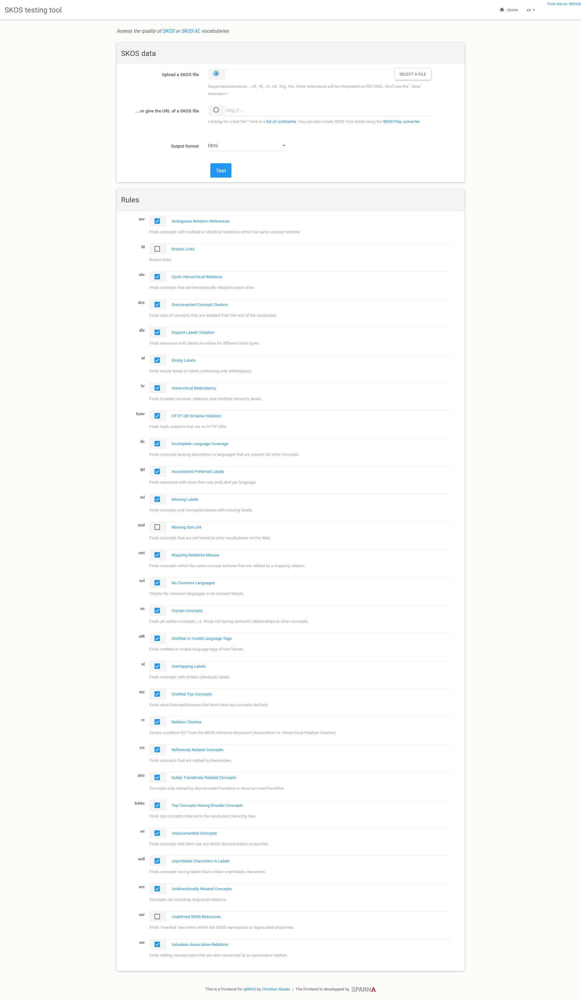
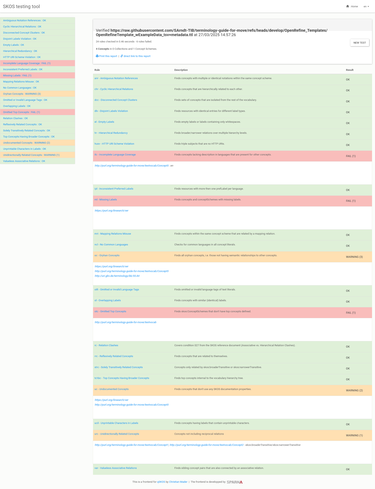

# Validierung, Qualitätsprüfung, FAIRness

## Qualitätsprüfungen

Neben einer inhaltlichen Qualitätsprüfung, die Teil des redaktionellen Workflows sein sollte, können auch formale Qualitätsprüfungen durchgeführt werden.
Bei diesen werden für den SKOS-Standard definierte Qualitätskriterien getestet und Meldungen gegeben, wenn diese verletzt wurden.
Diese Prüfung kann weitgehend automatisiert erfolgen, wofür es bereits einige Tools gibt.

### SKOS Testing Tool und qSKOS

Ein einfach zu nutzeneder Online-Dienst ist das [SKOS Testing Tool](https://skos-play.sparna.fr/skos-testing-tool/).
Dieser Dienst bezieht sich auf die in [[31]](../Literatur.md#source31) definierten und formalisierten [Qualitätskriterien für SKOS-Vokabulare](https://github.com/cmader/qSKOS/wiki/Quality-Issues).
Man kann bei diesem Dienst entweder eine Datei hochladen oder eine URL eingeben, die zu den RDF-Daten eines Vokabulars führt.
Zudem kann man die Tests aus- oder abwählen, die die einzelnen Qualitätskriterien abprüfen.

Zeige das Interface

Wenn wir den Test mit der URL für eines der Testvokabulare durchführen, z.B. <https://raw.githubusercontent.com/SArndt-TIB/terminology-guide-for-move/refs/heads/develop/OpenRefine_Templates/OpenRefineTemplate_wExampleData_tsv+metadata.ttl>, wird der Report generiert. Das Testvokabular erfüllt bereits die meisten Kriterien.
Die Rückmeldungen des Tools können den redaktionellen Workflow unterstützen.

> :warning: Leider scheint das Tool mit PURLs nicht arbeiten zu können. Wir empfehlen deswegen lieber gleich den Raw-Link des Repositoriums der zu prüfenden Datei oder einen Datei-Upload zu verwenden.

Zeige das Testergebnis

Erläutere die offenen Punkte

* ilc - Incomplete Language Coverage - Unser Concept5 hat keine englische Benennung erhalten - hier wäre also ein guter Ansatzpunkt zur Aktualisierung des Vokabulars, sofern eine vollständige Sprachabdeckung das Ziel ist.
* ml - Missing Labels - Der Begriff <https://purl.org/linsearch/ver> hat keine Labels, was aber auch nicht zwingend erforderlich ist. Er wird durch das Vokabular nur verwendet, jedoch nicht definiert. Dies erfolgt im Vokabular <https://purl.org/linsearch> das sich unabhängig vom Testvokabular weiterentwicklen kann. Insofern ist es nicht sinnvoll, seine Metadaten hier zu wiederholen, da sie veralten können.
* oc - Orphan Concepts - Die Begriffe <https://purl.org/linsearch/ver>. <http://purl.org/terminology-guide-for-move/testvocab/Concept5> und <http://uri.gbv.de/terminology/bk/55.84> haben keine Oberbegriffe und sind somit also "verwaist". Für die beiden fremden Begriffe ist dies nicht sonderlich schlimm. Für den in unserem eigenen Vokabular auftretenden Begriff hätte dieser Fehler nicht auftreten sollen.
Hier wird das Template also noch ausgebessert werden.
* otc - Omitted Top Concepts - Unserem Vokabular fehlen leider Begriffe, die als oberste Knoten der Begriffs-Hierarchie definiert werden. Auch dies hätte nicht vorkommen dürfen und muss in unseren Vorlagen und Mappingdateien behoben werden. Zu topConcepts siehe auch [SKOS-Tutorial](https://dini-ag-kim.github.io/skos-einfuehrung/#/skos-tutorial) und den [SKOS-Primer-Abschnitt zu ConceptSchemes](https://www.w3.org/TR/skos-primer/#secscheme).
* uc - Undocumented Concepts - Unser Concept5 aus dem Testvokabular hat keine Definition erhalten. Dies erfordert eine redaktionelle Handlung durch Überarbeitung des Vokabulars.
* urc - Unidirectionally Related Concepts - Unsere tabellarische Vorlage, mit der das Testvokabular im OpenRefine-Workflow erstellt wurde, sieht nur die Angabe von Oberbegriffen vor. So kann der Bearbeiter des Vokabulars entlastest werden. Unsere Mappingvorschrift legt die Beziehung zwischen den beiden Begriffen ebenfalls nur in eine Richtung an, das Test-Tool erwartet jedoch, dass die Beziehung in beide Richtungen angelegt wird. Dies sollte durch eine Aktualisierung der Mapping-Vorschrift behoben werden. Die Gegenrichtung der Beziehung ließe sich ja einfach erschließen.

Wer die Tests lieber auf lokalen Daten ausführen möchte, kann auch das Tool [qSKOS](https://github.com/cmader/qSKOS) verwenden, das aber ein Kommandozeilen-Tool ist.
Es hat eine [Installationsanleitung](https://github.com/cmader/qSKOS?tab=readme-ov-file#local-installation-) auf GitHub und auch eine gute [Dokumentation zur Nutzung](https://github.com/cmader/qSKOS?tab=readme-ov-file#using-the-qskos-command-line-tool-), ist aber vielleicht für Personen, die noch nicht mit Kommandozeilentools vertraut sind, gewöhnungsbedürftig bis nicht verwendbar.
All diesen Personen empfehlen wird dieses [Tutorial](https://swcarpentry.github.io/shell-novice/).

### Prüfung mit SHACL Play!

## FAIRness

Auch Terminologien, die für das Semantic Web aufbereitet werden, sollen am Ende den [FAIR-Prinzipien](https://www.go-fair.org/fair-principles/) genügen.
Das bedeutet, sie müssen **F**indable (auffindbar), **A**ccessible (zugänglich), **I**nteroperable (interoperabel) und **R**e-Usable (nachnutbar) sein.
Die FAIR-Prinzipien legen eine Reihe von Kriterien fest, die erfüllt sein müssen, damit eine Ressource FAIR ist.
Inzwischen wurden diese Kriterien auch schon im Sinne "semantischer Artefakte" (z.B. SKOS-Vokabulare, wie wir es hier erstellt haben) interpretiert und in entsprechenden Prüftools implementiert.
Ein solches Tool ist der [FOOPS Validator](https://foops.linkeddata.es/FAIR_validator.html), in den man einfach nur den Link einer Ressource eingeben muss, um eine Einschätzung ihrer FAIRness gegeliedert nach den einzelnen FAIR-Prinzipien zu bekommen.

Versuchen wir dies einmal mit einem im GitHub-Repositorium abgelegten Test-Vokabular, das wir im [Schritt 4](step-4/README.md) erstellt haben und für das wir in [Identifier erstellen](tutorial-7.md#purlorg) die PURL <http://purl.org/terminology-guide-for-move/testvocab> eingerichtet hatten.

Zeige Ergebnis des FOOPS-Validators für &#60;http://purl.org/terminology-guide-for-move/testvocab&#62;

Das Ergebnis ist noch relativ ernüchternd - das Vokabular erreicht gerade einmal 38&nbsp;% der maximal erreichbaren Punktzahl.
Dies liegt vor allem daran, dass hier noch keine Metadaten zum Vokabular enthalten sind.
Führen wir denselben Test für <http://purl.org/terminology-guide-for-move/testvocab+metadata> aus, so verdoppelt sich die erreichte Punktzahl ungefähr.

Zeige Ergebnis des FOOPS-Validators für &#60;http://purl.org/terminology-guide-for-move/testvocab+metadata&#62;

<!--  -->

Es gibt jedoch noch immer einige Punkte, die angemerkt werden und verbessert werden können.

Zeige Details

* Der Test _URI2: Consistent ontology IDs_ tritt hier nur auf, weil wir zwei verschiedene Dateien angelegt haben, die innerhalb der Datei denselben Identifiert verwenden, aber tatsächlich durch verschiedene Identifier aufgerufen werden müssen.
Wenn man - anders als in diesem Tutorial zu Demonstrationszwecken geschehen - nur eine Datei für das Vokabular anlegt (inkl. Metadaten) und die dafür registrierte PURL verwendet, schlägt dieser Test nicht aus.
* Die Tests _OM1: Minimum metadata_, _OM2: Recommended metadata_, _OM3: Detailed metadata_ und _OM5&#95;2: Detailed provenance metadata_ suchen nach Metadaten, die wir auch empfehlen, jedoch nicht vorschreiben und im Rahmen der Metadatengenerierung im Rahmen dieses Tutorials nicht angegeben haben.
* Der Test _FIND3: Ontology in metadata registry_ prüft, ob das Vokabular oder zumindest seine Metadaten in einem Terminology Service registriert sind. Der Test prüft dabei ausschließlich die Registrierung bei [Linked Open Vocabularies](https://lov.linkeddata.es/dataset/lov) ab und hat deswegen nur begrenzte Aussagekraft.
  Dasselbe prüft auch der Test _FIND&#95;3&#95;BIS: Metadata are accessible, even when ontology is not_ allerdings mit einer anderen Fragestellung. Auch hier wird die Prüfung nur auf [Linked Open Vocabularies](https://lov.linkeddata.es/dataset/lov) durchgeführt.
* Der Test _VER2: Version IRI resolves_ schlägt heute (24.03.2025) noch aus: der Versions-Identifier wird in der Ontologie zwar schon verwendet, aber da das Tutorial gerade noch erarbeitet wird, konnte noch kein entsprechendes Release herausgeben werden, auf das eine Weiterleitung eingerichtet werden kann. Dieser Test ist erst dann nicht mehr positiv, wenn das Release erschienen ist und die Weiterlitung das benötigte Ziel hat.
* _VOC4: Documentation: definitions_ sucht nach beschreibenden Texten für die einzelnen Begriffe. Unser Vokabular entspricht hierbei nicht ganz dem wonach dieses Tool sucht. Wir haben das Vokabular sowohl als OWL Ontologie als auch als SKOS Vokabular deklariert. Das Tool scheint es nur einer dieser beiden Kategorien zuzuordnen und sucht deswegen nach rdfs:comments. Diese Property verwendet das Vokabular nicht, da sie unseres Erachtens zu allgemein ist, um eine Definition anzugeben. Stattdessen verwenden wir eine Property namens `skos:definition`, die in unserem Vokabular durch das Tool nicht erkannt wird.

<!-- ## Metadata validation -->
